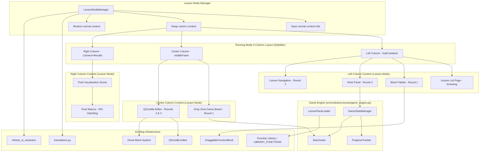
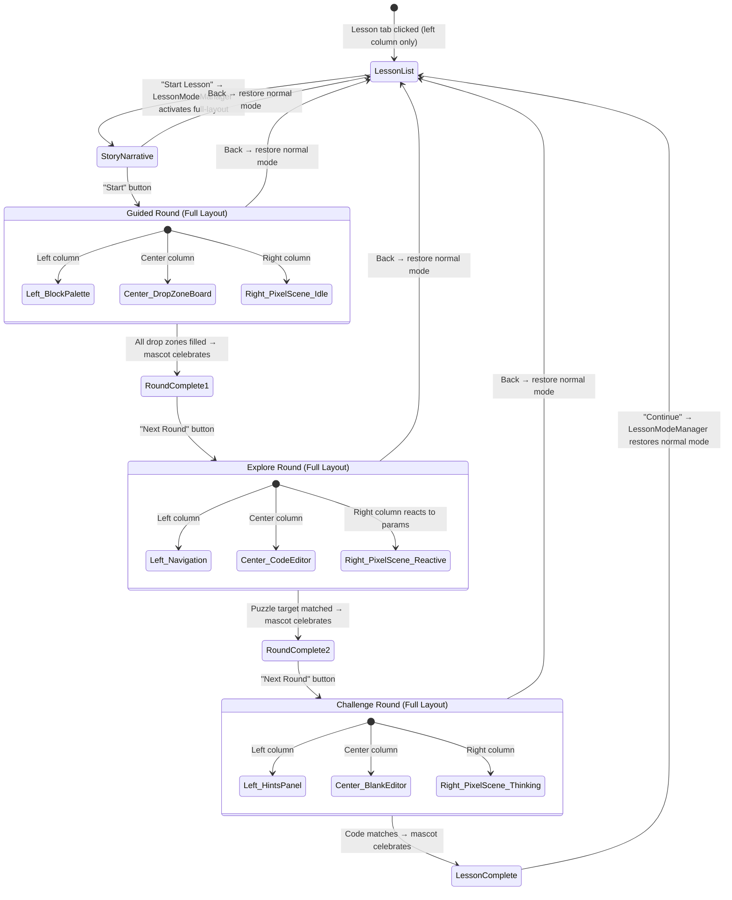

# Design Document: Coding Game Chapters

## Overview

This feature adds a gamified, lesson-based coding experience to the AI Coding Lab, accessible via a new "Lesson" tab (📖) in the Learning Hub. The system follows a three-tier hierarchy — Lesson Pack → Lesson → Round — where each Lesson teaches a single concept through three progressive rounds: Guided (drag-and-drop with colored drop zones), Explore (parameter tweaking to match a puzzle target), and Challenge (build from scratch using the full Function Library).

The key architectural change is **full-layout lesson mode**: when a student starts a lesson, the system takes over ALL THREE COLUMNS of the existing Running Mode QSplitter layout. The left column becomes a block palette (Round 1) or hints panel (Round 3), the center column becomes the playground (drop zone game board for Round 1, code editor for Rounds 2-3), and the right column becomes a **Pixel Visualization Scene** with an animated KDI Hatchling pixel mascot. When the student exits lesson mode, the normal Running Mode content returns to all three columns.

The **Pixel Visualization Scene** is a QPainter-rendered pixel art game world in the right column. It contains the KDI Hatchling mascot as a code-drawn pixel art character (~200-300px) with multiple animation states (idle, happy, sad, celebrating, thinking, pointing) driven by QTimer frame-based animation. For image processing lessons, the scene visualizes effects (grayscale, blur, brightness, rotation) in real time as the student tweaks parameters.

The architecture integrates cleanly with the existing PyQt5 codebase: reusing `DraggableFunctionBlock` for block rendering, the QScintilla editor for code editing in Explore/Challenge rounds, the MIME-based drag protocol (`QMimeData.setText`) for drag-and-drop, and the `translations.py` system for bilingual EN/VI support. Lesson content is defined in JSON files under `src/modules/courses/lessons/`, and progress is persisted to `game/progress.json`.

### Key Design Decisions

1. **Full-layout lesson mode via content swapping**: The existing 3-column QSplitter layout stays unchanged. A `LessonModeManager` swaps the CONTENT of each column when entering/exiting lesson mode, saving and restoring the normal Running Mode widgets. This avoids modifying the core layout structure.
2. **Pixel mascot as code-drawn art**: The mascot is rendered via QPainter pixel-by-pixel (not a static PNG), enabling smooth animation states and dynamic reactions. Frame-based animation with QTimer keeps it lightweight for Jetson hardware.
3. **JSON-driven content**: All lesson content lives in JSON definition files, not in Python code. This allows educators to author new packs without touching the codebase.
4. **Reuse over rebuild**: The Guided Round creates lightweight `DraggableFunctionBlock` instances from `LIBRARY_FUNCTIONS` definitions. The Challenge Round uses the existing `populate_functions_tab` directly. No modifications to core library code.
5. **Single Game_Engine module**: All game logic (loading, grading, progression, persistence) lives in `src/modules/courses/game_engine.py`, keeping `main.py` integration thin.
6. **Flat lesson list UI (like Examples tab)**: The Lesson tab displays a flat scrollable list of lesson cards grouped by pack/theme with section headers — matching the Examples tab pattern.
7. **Scene effects for Explore Round**: The Pixel Visualization Scene reacts to parameter changes (brightness, rotation, grayscale) making the Explore Round feel like tuning a game world rather than just editing code.

## Architecture



### Navigation Flow



## Components and Interfaces

### 1. Game Engine (`src/modules/courses/game_engine.py`)

The central module containing all game logic classes. Unchanged from original design.

#### LessonPackLoader

```python
class LessonPackLoader:
    """Scans and loads Lesson_Definition_File JSON files from src/modules/courses/lessons/."""

    def __init__(self, lessons_dir: str = "src/modules/courses/lessons/"):
        self.lessons_dir = lessons_dir
        self.packs: dict[str, LessonPack] = {}  # pack_id → LessonPack

    def load_all(self) -> dict[str, LessonPack]:
        """Scan directory, parse each JSON, validate required fields, return loaded packs.
        Logs errors and skips invalid files without crashing."""

    def _validate_pack(self, data: dict) -> bool:
        """Check required fields: id, title, title_vi, description, description_vi, icon, color, lessons."""

    def _validate_lesson(self, data: dict) -> bool:
        """Check required fields: id, title, title_vi, story, story_vi, block_count, star_thresholds, rounds."""

    def _validate_rounds(self, rounds: dict) -> bool:
        """Check guided (template_steps, correct_blocks, distractor_blocks),
        explore (code_template, editable_params, puzzle_target, scene_effect),
        challenge (expected_blocks, expected_params, hint_categories)."""
```

#### StarGrader

```python
class StarGrader:
    """Calculates star ratings based on mistake counts and configurable thresholds."""

    DEFAULT_THRESHOLDS = {"three_star": 0, "two_star": 2, "one_star": 3}

    def grade(self, mistakes: int, thresholds: dict | None = None) -> int:
        """Return 1-3 star rating. Uses custom thresholds if provided, else defaults.
        3 stars: mistakes <= three_star_max
        2 stars: mistakes <= two_star_max
        1 star:  otherwise"""

    def get_thresholds(self, lesson_data: dict) -> dict:
        """Extract star_thresholds from lesson data, falling back to DEFAULT_THRESHOLDS."""
```

#### ProgressTracker

```python
class ProgressTracker:
    """Persists and loads game progress from game/progress.json."""

    def __init__(self, progress_path: str = "game/progress.json"):
        self.progress_path = progress_path
        self.data: dict = {}

    def load(self) -> dict:
        """Load progress file. Create fresh state if missing or corrupted."""

    def save(self):
        """Write current state to JSON file."""

    def get_round_stars(self, pack_id: str, lesson_id: str, round_type: str) -> int:
        """Return best star rating for a specific round (0 if not attempted)."""

    def set_round_stars(self, pack_id: str, lesson_id: str, round_type: str, stars: int):
        """Update star rating only if new value is higher than stored. Auto-saves."""

    def is_lesson_complete(self, pack_id: str, lesson_id: str) -> bool:
        """True if all 3 rounds have been completed (stars > 0)."""

    def is_round_complete(self, pack_id: str, lesson_id: str, round_type: str) -> bool:
        """True if round has stars > 0."""

    def get_unlocked_lessons(self, pack_id: str) -> list[str]:
        """Return list of unlocked lesson IDs for a pack."""

    def unlock_next_lesson(self, pack_id: str, current_lesson_id: str, all_lesson_ids: list[str]):
        """Unlock the lesson after current_lesson_id in the ordered list. Auto-saves."""

    def initialize_pack(self, pack_id: str, first_lesson_id: str):
        """Create initial progress entry for a pack with first lesson unlocked."""
```

#### GameStateManager

```python
class GameStateManager:
    """Manages the current game navigation state (active pack, lesson, round, mistakes)."""

    def __init__(self, loader: LessonPackLoader, grader: StarGrader, tracker: ProgressTracker):
        self.loader = loader
        self.grader = grader
        self.tracker = tracker
        self.current_pack_id: str | None = None
        self.current_lesson_id: str | None = None
        self.current_round: str | None = None  # "guided", "explore", "challenge"
        self.mistakes: int = 0

    def select_pack(self, pack_id: str): ...
    def select_lesson(self, lesson_id: str) -> bool: ...  # False if locked
    def start_round(self, round_type: str): ...
    def record_mistake(self): ...
    def complete_round(self) -> int: ...  # Returns star rating
    def get_current_lesson_data(self) -> dict: ...
    def get_current_round_data(self) -> dict: ...
    def reset_mistakes(self): ...
```

### 2. Lesson Mode Manager (`src/modules/courses/lesson_mode_manager.py`) — NEW

Manages the transition between normal Running Mode and full-layout lesson mode by swapping the content of all three columns.

```python
class LessonModeManager:
    """Swaps column content when entering/exiting lesson mode.
    Saves references to normal Running Mode widgets and restores them on exit."""

    def __init__(self, main_splitter, hub_container, middle_panel, camera_results_panel):
        self.main_splitter = main_splitter  # The existing QSplitter
        self.hub_container = hub_container  # Left column normal content
        self.middle_panel = middle_panel    # Center column normal content
        self.cam_results = camera_results_panel  # Right column normal content

        # Saved references for restoration
        self._saved_left: QWidget | None = None
        self._saved_center: QWidget | None = None
        self._saved_right: QWidget | None = None
        self._is_lesson_mode: bool = False

        # Lesson mode widgets
        self.left_stack: QStackedWidget = None   # Block palette / hints / nav
        self.center_stack: QStackedWidget = None  # Drop zone board / editor
        self.pixel_scene: PixelScene = None       # Right column pixel world

    def enter_lesson_mode(self):
        """Save current column content, swap in lesson mode widgets.
        Hides normal widgets, shows lesson widgets in the splitter."""

    def exit_lesson_mode(self):
        """Restore normal Running Mode content to all three columns.
        Hides lesson widgets, shows saved normal widgets."""

    def set_left_content(self, content_type: str):
        """Switch left column: 'palette' for Round 1, 'hints' for Round 3,
        'navigation' for Round 2, 'list' for browsing."""

    def set_center_content(self, content_type: str):
        """Switch center column: 'board' for Round 1, 'editor' for Rounds 2-3."""

    @property
    def is_active(self) -> bool:
        """Whether lesson mode is currently active."""
        return self._is_lesson_mode
```

### 3. Pixel Visualization Scene (`src/modules/courses/pixel_scene.py`) — NEW

A QPainter-rendered pixel art game world for the right column.

```python
class PixelScene(QWidget):
    """Pixel art game world rendered via QPainter. Contains the pixel mascot
    and a themed background. Supports visual effect overlays."""

    def __init__(self, is_small: bool, parent=None):
        self.mascot = PixelMascot(is_small)
        self._background_theme: str = "default"  # "camera_studio", "photo_lab", etc.
        self._effect_type: str | None = None      # "brightness", "rotation", "grayscale", "blur"
        self._effect_value: float = 0.0
        self._is_small = is_small

    def set_theme(self, theme: str):
        """Set background theme based on current Lesson_Pack."""

    def set_effect(self, effect_type: str, value: float):
        """Apply visual effect overlay: brightness, rotation, grayscale, blur.
        Updates the scene rendering in real time."""

    def clear_effect(self):
        """Remove any active visual effect overlay."""

    def paintEvent(self, event):
        """Render the pixel art scene: background → effects → mascot."""

    def update_resolution(self, is_small: bool):
        """Scale scene and mascot for resolution mode."""
```

### 4. Pixel Mascot (`src/modules/courses/pixel_mascot.py`) — NEW

Code-drawn pixel art character with animation states.

```python
class MascotState(Enum):
    IDLE = "idle"
    HAPPY = "happy"
    SAD = "sad"
    CELEBRATING = "celebrating"
    THINKING = "thinking"
    POINTING = "pointing"

class PixelMascot(QObject):
    """KDI Hatchling rendered as code-drawn pixel art using QPainter.
    Supports frame-based animation driven by QTimer."""

    STANDARD_SIZE = 250   # ~250px in standard mode
    SMALL_SIZE = 180      # ~180px in small mode

    state_changed = pyqtSignal(str)  # Emits new state name

    def __init__(self, is_small: bool, parent=None):
        self._state: MascotState = MascotState.IDLE
        self._frame: int = 0
        self._animation_timer = QTimer()
        self._animation_timer.timeout.connect(self._advance_frame)
        self._animation_timer.setInterval(150)  # ~6.7 FPS for pixel art
        self._is_small = is_small
        self._size = self.SMALL_SIZE if is_small else self.STANDARD_SIZE

        # Pixel art frame data: dict of state → list of frame pixel maps
        self._frames: dict[MascotState, list] = self._build_frames()

    def set_state(self, state: MascotState):
        """Transition to a new animation state. Resets frame counter."""

    def draw(self, painter: QPainter, x: int, y: int):
        """Draw the current frame of the mascot at the given position."""

    def _advance_frame(self):
        """Move to next animation frame. Loops for idle, plays once for others."""

    def _build_frames(self) -> dict:
        """Build pixel art frame data for each animation state.
        Each frame is a list of (x, y, color) tuples defining pixels."""

    def _draw_pixel_grid(self, painter: QPainter, x: int, y: int, pixels: list, scale: int):
        """Render a pixel grid at the given position with the given scale factor."""

    def update_resolution(self, is_small: bool):
        """Update size for resolution mode."""

    @property
    def current_state(self) -> MascotState:
        return self._state
```

### 5. Block Palette (`src/modules/courses/block_palette.py`) — NEW

Left column content for Guided Round showing available draggable blocks.

```python
class BlockPalette(QWidget):
    """Left column widget for Guided Round. Displays draggable code blocks
    (correct + distractors) in a clear, attractive vertical layout."""

    def __init__(self, is_small: bool, lang: str, parent=None):
        self._blocks: list[DraggableFunctionBlock] = []

    def setup(self, correct_blocks: list[str], distractor_blocks: list[str]):
        """Create DraggableFunctionBlock widgets from LIBRARY_FUNCTIONS,
        shuffle them, and display in the palette."""

    def remove_block(self, func_id: str):
        """Remove a block from the palette after it's been correctly placed."""

    def retranslate(self, strings: dict): ...
    def update_resolution(self, is_small: bool): ...
```

### 6. Drop Zone Game Board (`src/modules/courses/drop_zone_board.py`) — NEW

Center column content for Guided Round — visual puzzle-like game board.

```python
class DropZone(QFrame):
    """A large, colorful, numbered rectangle that accepts drops via MIME text matching.
    Designed to look like a puzzle slot — visually attractive for young students."""
    block_dropped = pyqtSignal(str, int)  # function_id, zone_index

    def __init__(self, index: int, label: str, expected_block: str, color: str, is_small: bool): ...
    def dragEnterEvent(self, event): ...  # Accept if MIME text present
    def dropEvent(self, event): ...  # Emit block_dropped with function_id
    def mark_correct(self, block_name: str): ...  # Green highlight + show block name
    def mark_error(self): ...  # Red flash animation

class DropZoneBoard(QWidget):
    """Center column widget for Guided Round. Visual puzzle-like layout of drop zones."""
    all_zones_filled = pyqtSignal()  # Emitted when all zones correctly filled
    correct_drop = pyqtSignal(str, int)  # func_id, zone_index
    incorrect_drop = pyqtSignal(str, int)  # func_id, zone_index

    def __init__(self, is_small: bool, lang: str, parent=None): ...
    def setup(self, template_steps: list[dict], correct_blocks: list[str]): ...
    def _on_block_dropped(self, func_id: str, zone_index: int): ...
    def retranslate(self, strings: dict): ...
    def update_resolution(self, is_small: bool): ...
```

### 7. Lesson Panel UI (`src/modules/courses/game_panel.py`)

Updated to coordinate with `LessonModeManager` instead of containing everything in the hub column.

#### LessonPanel

```python
class LessonPanel(QWidget):
    """Main lesson UI coordinator. Lives in the left column for browsing.
    Coordinates with LessonModeManager for full-layout lesson mode."""

    # Signals for main.py integration
    enter_lesson_mode = pyqtSignal()   # Request full-layout activation
    exit_lesson_mode = pyqtSignal()    # Request normal mode restoration

    def __init__(self, game_state: GameStateManager, lesson_mode_mgr: LessonModeManager,
                 is_small: bool, lang: str, parent=None):
        self.game_state = game_state
        self.mode_mgr = lesson_mode_mgr
        self.stacked = QStackedWidget()
        self.lesson_list_page = LessonListPage(...)
        self.story_page = StoryNarrativePage(...)

    def start_lesson(self, pack_id: str, lesson_id: str):
        """Activate full-layout lesson mode via LessonModeManager,
        show story narrative, configure pixel scene theme."""

    def start_round(self, round_type: str):
        """Configure all 3 columns for the given round type via LessonModeManager."""

    def exit_lesson(self):
        """Deactivate lesson mode, restore normal Running Mode."""

    def navigate_to(self, page_name: str, **kwargs): ...
    def retranslate(self, strings: dict): ...
    def update_resolution(self, is_small: bool): ...
```

#### LessonListPage

Displays a flat scrollable list of `LessonCard` widgets grouped by pack/theme with `PackHeader` section dividers.

```python
class PackHeader(QFrame):
    """Section header/group divider for a Lesson Pack in the flat lesson list."""
    def __init__(self, pack_data: dict, is_small: bool, lang: str): ...

class LessonCard(QFrame):
    """Card for a single lesson: title, description, 3-dot completion indicator, 'Start Lesson' button."""
    start_clicked = pyqtSignal(str, str)  # Emits (pack_id, lesson_id)
    def __init__(self, lesson_data: dict, pack_id: str, state: str, stars: int,
                 round_completion: dict, is_small: bool, lang: str): ...

class CompletionDots(QWidget):
    """Horizontal row of 3 dots showing round completion."""
    def __init__(self, round_completion: dict, is_small: bool): ...
```

#### StoryNarrativePage

Displays the story text in the left column while the pixel mascot shows in the right column (pointing animation).

```python
class StoryNarrativePage(QWidget):
    """Story display with narrative text. Pixel mascot shows in PixelScene (right column)."""
    start_clicked = pyqtSignal()
    def __init__(self, is_small: bool, lang: str): ...
    def set_story(self, story_text: str): ...
```

### 8. Round Widgets (`src/modules/courses/round_widgets.py`)

Updated to emit signals that the LessonPanel uses to coordinate mascot reactions.

#### ExploreRoundWidget

```python
class ExploreRoundWidget(QWidget):
    """Pre-filled code in QScintilla with editable parameters. Submit checks against puzzle target.
    Emits param_changed signal for PixelScene to react to parameter tweaks."""
    round_complete = pyqtSignal(int)  # Emits mistake count
    mistake_made = pyqtSignal()
    param_changed = pyqtSignal(str, float)  # effect_type, value — for PixelScene feedback

    def __init__(self, editor_ref, is_small: bool, lang: str): ...
    def setup(self, round_data: dict, lesson_data: dict): ...
    def _lock_non_editable_regions(self, code: str, editable_params: list): ...
    def _on_submit(self): ...
    def _check_params(self) -> bool: ...
    def _on_param_edit(self): ...  # Detect param changes, emit param_changed
```

#### ChallengeRoundWidget

```python
class ChallengeRoundWidget(QWidget):
    """Blank template in editor. Student drags from full Function Library. Submit validates structure."""
    round_complete = pyqtSignal(int)  # Emits mistake count
    mistake_made = pyqtSignal()

    def __init__(self, editor_ref, is_small: bool, lang: str): ...
    def setup(self, round_data: dict, lesson_data: dict): ...
    def _on_submit(self): ...
    def _validate_code(self, code: str, expected_blocks: list, expected_params: dict) -> bool: ...
```

### 9. Mascot Widget (`src/modules/courses/mascot_widget.py`)

Retained for text-based mascot messages in the left column (story, hints). The pixel mascot in the right column is separate.

```python
class MascotMessage(QFrame):
    """Reusable widget: KDI Hatchling text + speech bubble. Used in left column panels."""

    def __init__(self, is_small: bool, parent=None): ...
    def set_message(self, text: str, style: str = "info"): ...  # style: info, success, error, hint
    def update_resolution(self, is_small: bool): ...
```

### 10. Hint Panel (`src/modules/courses/hint_panel.py`)

Left column content for Challenge Round.

```python
class HintPanel(QWidget):
    """Left column widget for Challenge Round. Sequential hint reveal with mascot guidance.
    Also provides access to the Function Library for browsing."""

    hint_revealed = pyqtSignal()  # Emitted when a hint is shown — triggers mascot pointing

    def __init__(self, is_small: bool, lang: str, parent=None): ...
    def set_hints(self, hints: list[str], hint_categories: list[str]): ...
    def reveal_next(self) -> str | None: ...  # Returns hint text or None if all revealed
    def reset(self): ...
    def retranslate(self, strings: dict): ...
```

### 11. Integration in `main.py`

Integration layer — approximately 80-120 lines added to `main.py`:

- Import `LessonPanel`, `LessonModeManager`, `PixelScene`, `GameStateManager`
- Add `tabLesson` QPushButton to `hubTabsLayout` in `_setup_hub_tabs()` with 📖 icon
- Add `pageLesson` to `hubStackedWidget`
- Create `LessonModeManager` with references to `mainSplitter`, `hubContainer`, `middlePanel`, camera/results panel
- Create `PixelScene` and lesson column widgets
- Wire `LessonPanel.enter_lesson_mode` → `LessonModeManager.enter_lesson_mode()`
- Wire `LessonPanel.exit_lesson_mode` → `LessonModeManager.exit_lesson_mode()`
- Connect mascot state signals: correct_drop → mascot.set_state(HAPPY), mistake → mascot.set_state(SAD), round_complete → mascot.set_state(CELEBRATING), hint_revealed → mascot.set_state(POINTING)
- Connect ExploreRoundWidget.param_changed → PixelScene.set_effect()
- Add lesson panel to `retranslate_ui()` and `refresh_ui_resolution()` calls

## Data Models

### Lesson Definition File Schema (JSON)

```json
{
  "id": "camera_basics",
  "title": "Camera Basics",
  "title_vi": "Cơ Bản Camera",
  "description": "Learn to control the camera step by step",
  "description_vi": "Học cách điều khiển camera từng bước",
  "icon": "📷",
  "color": "#22c55e",
  "scene_theme": "camera_studio",
  "story_intro": "KDI Hatchling just got a brand new camera and needs your help to set it up!",
  "story_intro_vi": "KDI Hatchling vừa có một camera mới và cần bạn giúp thiết lập!",
  "lessons": [
    {
      "id": "lesson_1_init_camera",
      "title": "Start the Camera",
      "title_vi": "Khởi Động Camera",
      "story": "KDI needs to turn on the camera before the big robot show! Can you help?",
      "story_vi": "KDI cần bật camera trước buổi trình diễn robot! Bạn giúp nhé?",
      "block_count": 3,
      "star_thresholds": {
        "three_star": 0,
        "two_star": 2,
        "one_star": 4
      },
      "rounds": {
        "guided": {
          "template_steps": [
            {"label": "Initialize the camera", "label_vi": "Khởi tạo camera", "color": "#f97316"},
            {"label": "Capture a frame", "label_vi": "Chụp một khung hình", "color": "#10b981"},
            {"label": "Show the image", "label_vi": "Hiển thị hình ảnh", "color": "#6366f1"}
          ],
          "correct_blocks": ["Init_Camera", "Get_Camera_Frame", "Show_Image"],
          "distractor_blocks": ["Close_Camera", "apply_blur"]
        },
        "explore": {
          "code_template": "import camera\nimport display\n\ncapture_camera = camera.Init_Camera()\ncamera_frame = camera.Get_Camera_Frame(capture_camera = capture_camera)\ndisplay.Show_Image(camera_frame = camera_frame)",
          "editable_params": [],
          "puzzle_target": "Run the code and see the camera feed appear in the Live Feed panel",
          "puzzle_target_vi": "Chạy mã và xem hình ảnh camera xuất hiện trong bảng Live Feed",
          "scene_effect": "none"
        },
        "challenge": {
          "expected_blocks": ["Init_Camera", "Get_Camera_Frame", "Show_Image"],
          "expected_params": {},
          "hint_categories": ["Camera", "Display & Dashboard"],
          "hints": [
            "Start by initializing the camera — look in the Camera category!",
            "Next, capture a frame from the camera you just started.",
            "Finally, show the image using a Display function."
          ],
          "hints_vi": [
            "Bắt đầu bằng cách khởi tạo camera — tìm trong danh mục Camera!",
            "Tiếp theo, chụp một khung hình từ camera vừa khởi tạo.",
            "Cuối cùng, hiển thị hình ảnh bằng hàm Display."
          ]
        }
      }
    }
  ]
}
```

### Game Progress File Schema (`game/progress.json`)

```json
{
  "version": 1,
  "packs": {
    "camera_basics": {
      "unlocked_lessons": ["lesson_1_init_camera", "lesson_2_live_feed"],
      "active_lesson": "lesson_2_live_feed",
      "lessons": {
        "lesson_1_init_camera": {
          "rounds": {
            "guided": {"completed": true, "best_stars": 3, "attempts": 1},
            "explore": {"completed": true, "best_stars": 2, "attempts": 2},
            "challenge": {"completed": true, "best_stars": 3, "attempts": 1}
          }
        },
        "lesson_2_live_feed": {
          "rounds": {
            "guided": {"completed": false, "best_stars": 0, "attempts": 0},
            "explore": {"completed": false, "best_stars": 0, "attempts": 0},
            "challenge": {"completed": false, "best_stars": 0, "attempts": 0}
          }
        }
      }
    }
  }
}
```

### Translation Keys (added to `translations.py`)

```python
# Lesson tab and navigation
"TAB_LESSON": "Lesson",
"LESSON_TITLE": "📖 Coding Lessons",
"LESSON_BACK": "← Back",
"LESSON_ROUND_INDICATOR": "Round {}/3",
"LESSON_MISTAKES": "Mistakes: {}",
"LESSON_STARS": "★ {}/9",

# Round labels
"LESSON_ROUND_GUIDED": "Guided",
"LESSON_ROUND_EXPLORE": "Explore",
"LESSON_ROUND_CHALLENGE": "Challenge",

# Buttons
"LESSON_START": "Start Lesson",
"LESSON_NEXT_ROUND": "Next Round →",
"LESSON_SUBMIT": "Submit",
"LESSON_RUN": "▶ Run",
"LESSON_HINT": "💡 Hint",
"LESSON_REPLAY": "Replay",
"LESSON_CONTINUE": "Continue →",
"LESSON_NO_MORE_HINTS": "No more hints",
"LESSON_EXIT": "Exit Lesson",

# Mascot messages
"MASCOT_PERFECT": "Perfect! You're amazing! 🌟",
"MASCOT_GOOD": "Great job! ⭐",
"MASCOT_TRY_AGAIN": "Good effort! Try again for more stars!",
"MASCOT_MISTAKE": "Almost! Try again!",
"MASCOT_LOCKED": "Complete {} first to unlock this lesson!",
"MASCOT_HINT_CATEGORY": "Look in the {} category!",

# Lesson states
"LESSON_LOCKED": "🔒 Locked",
"LESSON_AVAILABLE": "Available",
"LESSON_COMPLETED": "Completed",

# Pixel scene
"PIXEL_SCENE_TITLE": "🎮 Game World",
```

## Correctness Properties

*A property is a characteristic or behavior that should hold true across all valid executions of a system — essentially, a formal statement about what the system should do. Properties serve as the bridge between human-readable specifications and machine-verifiable correctness guarantees.*

### Property 1: Lesson definition validation accepts exactly valid structures

*For any* JSON dictionary, the `LessonPackLoader` validation shall accept it if and only if all required fields are present at every level: pack-level (`id`, `title`, `title_vi`, `description`, `description_vi`, `icon`, `color`, `lessons`), lesson-level (`id`, `title`, `title_vi`, `story`, `story_vi`, `block_count`, `star_thresholds`, `rounds`), guided-round (`template_steps`, `correct_blocks`, `distractor_blocks`), explore-round (`code_template`, `editable_params`, `puzzle_target`, `scene_effect`), and challenge-round (`expected_blocks`, `expected_params`, `hint_categories`).

**Validates: Requirements 1.3, 1.4, 1.5, 1.6, 1.7**

### Property 2: Invalid JSON resilience

*For any* string that is not valid JSON or any JSON object missing required fields, the `LessonPackLoader` shall return a result that excludes the invalid entry without raising an exception, and all other valid entries in the same batch shall still be loaded successfully.

**Validates: Requirements 1.9**

### Property 3: Star grading is monotonically non-increasing with mistakes

*For any* non-negative mistake count and any valid star threshold configuration (default or custom), the `StarGrader` shall return a rating between 1 and 3 inclusive, and for any two mistake counts where `m1 < m2`, the star rating for `m1` shall be greater than or equal to the star rating for `m2`.

**Validates: Requirements 3.1, 3.3**

### Property 4: Best star rating persistence (max invariant)

*For any* sequence of star ratings (each 1-3) applied to the same round via `ProgressTracker.set_round_stars`, the stored `best_stars` value shall always equal the maximum value in the sequence.

**Validates: Requirements 3.5, 3.6**

### Property 5: Aggregate star computation

*For any* lesson with three rounds each having a best star rating between 0 and 3, the aggregate star count shall equal the sum of the three round ratings and shall be in the range 0-9.

**Validates: Requirements 3.7**

### Property 6: Drop zone block validation

*For any* drop zone with an expected block ID and any dragged block ID, the drop shall be accepted if and only if the dragged block ID exactly matches the expected block ID for that zone position.

**Validates: Requirements 4.4, 4.5, 14.6**

### Property 7: Guided round block set composition

*For any* guided round definition with `correct_blocks` and `distractor_blocks` arrays, the generated block set shall contain exactly the union of both arrays (no duplicates, no missing, no extras), and the number of drop zones shall equal the length of `template_steps`.

**Validates: Requirements 4.3, 4.8**

### Property 8: Explore round parameter validation

*For any* set of parameter values and a puzzle target, the `ExploreRoundWidget` submission shall succeed if and only if all editable parameter values match their corresponding puzzle target values.

**Validates: Requirements 5.6, 5.7**

### Property 9: Challenge round code validation

*For any* code string and expected block/parameter specification, the `ChallengeRoundWidget` validation shall pass if and only if the code contains all expected blocks in the correct order with matching parameter values.

**Validates: Requirements 6.6, 6.7**

### Property 10: Sequential round unlock enforcement

*For any* lesson progress state, the Explore round shall be accessible if and only if the Guided round is completed (stars > 0), and the Challenge round shall be accessible if and only if the Explore round is completed (stars > 0).

**Validates: Requirements 7.4**

### Property 11: Lesson card state computation

*For any* lesson within a pack, the computed visual state shall be: "locked" if the lesson ID is not in the pack's unlocked list, "available" if unlocked but not all 3 rounds are completed, and "completed" if all 3 rounds have stars > 0. The 3-dot completion indicator shall show green dots (●) for completed rounds and gray dots (○) for incomplete rounds.

**Validates: Requirements 7.1, 7.5**

### Property 12: Lesson completion triggers next unlock

*For any* lesson where all three rounds transition to completed (stars > 0), the `ProgressTracker` shall mark the lesson as completed and unlock the next sequential lesson in the pack's ordered lesson list (if one exists).

**Validates: Requirements 7.3**

### Property 13: Progress serialization round-trip

*For any* valid game progress state, serializing to JSON via `ProgressTracker.save()` and then deserializing via `ProgressTracker.load()` shall produce a state equivalent to the original, preserving all pack data, unlocked lessons, round completion flags, best star ratings, and attempt counts.

**Validates: Requirements 8.2, 8.3, 8.4, 8.6**

### Property 14: Corrupted progress recovery

*For any* string that is not valid JSON or any JSON object that does not conform to the expected progress schema, `ProgressTracker.load()` shall return a valid default progress state (all packs at initial state with first lesson unlocked) without raising an exception.

**Validates: Requirements 8.7**

### Property 15: Bilingual content selection

*For any* content object containing both an English field (`story`, `title`, `hints`, etc.) and its Vietnamese counterpart (`story_vi`, `title_vi`, `hints_vi`), the content resolver shall return the English field when the language is "en" and the Vietnamese field when the language is "vi".

**Validates: Requirements 2.3, 10.6, 11.3, 13.9**

### Property 16: Sequential hint reveal

*For any* hint array of length N (1 ≤ N ≤ 3), calling `HintPanel.reveal_next()` K times (K ≤ N) shall reveal exactly the first K hints in order, and after N reveals the panel shall report no more hints available.

**Validates: Requirements 10.2, 10.5**

### Property 17: Mascot message category selection

*For any* star rating (1, 2, or 3), the mascot message selector shall return a "celebratory" message for 3 stars, a "good" message for 2 stars, and an "encouraging" message for 1 star.

**Validates: Requirements 13.10, 13.11**

### Property 18: Library function filtering

*For any* subset of function IDs that all exist in `LIBRARY_FUNCTIONS`, filtering the library by that subset shall return entries for exactly those IDs with their correct category colors and icons preserved.

**Validates: Requirements 14.2**

### Property 19: Mascot state transitions

*For any* valid game event (correct_drop, incorrect_drop, round_complete, hint_revealed), the `PixelMascot` shall transition to the corresponding animation state: correct_drop → HAPPY, incorrect_drop → SAD, round_complete → CELEBRATING, hint_revealed → POINTING. After the animation completes, the mascot shall return to IDLE.

**Validates: Requirements 13.4, 13.5, 13.6, 13.7**

## Error Handling

### JSON Loading Errors
- **Invalid JSON syntax**: `LessonPackLoader` catches `json.JSONDecodeError`, logs the filename and error message to console via `print()`, skips the file.
- **Missing required fields**: Validation methods return `False`, loader logs which fields are missing, skips the file.
- **Empty lessons directory**: Loader returns an empty dict; Lesson Panel shows a "No lesson packs available" message.

### Progress File Errors
- **Missing file**: `ProgressTracker.load()` creates a fresh default state and writes it to disk.
- **Corrupted JSON**: Catches `json.JSONDecodeError`, backs up the corrupted file as `progress.json.bak`, creates fresh state.
- **Schema mismatch** (e.g., missing keys after app update): Merges existing data with defaults, preserving any valid progress data.
- **Write failure** (disk full, permissions): Catches `IOError`, logs warning, continues with in-memory state. Retries on next save trigger.

### Lesson Mode Manager Errors
- **Column widget reference lost**: If a saved widget reference becomes invalid during lesson mode, `exit_lesson_mode()` catches `RuntimeError` and recreates default widgets.
- **Double enter/exit**: `LessonModeManager` tracks `_is_lesson_mode` flag and ignores redundant enter/exit calls.

### Pixel Scene Errors
- **Invalid effect type**: `PixelScene.set_effect()` ignores unrecognized effect types with a console warning.
- **QPainter errors**: `paintEvent` wraps rendering in try/except, falls back to a solid color background if pixel art rendering fails.

### UI Errors
- **Missing mascot frames**: `PixelMascot` falls back to a simple colored rectangle if frame data is corrupted.
- **Invalid function ID in lesson definition**: If a `correct_blocks` or `distractor_blocks` ID doesn't exist in `LIBRARY_FUNCTIONS`, the block is skipped with a console warning, and the round proceeds with available blocks.
- **Editor integration failures**: If QScintilla editor reference is unavailable (e.g., during mode transitions), round widgets catch `AttributeError` and display an error message via the mascot.

### Drag-and-Drop Errors
- **MIME data missing**: `DropZone.dropEvent` checks `event.mimeData().hasText()` before processing; ignores drops without text data.
- **Unexpected function ID**: Drop zones reject any ID not in the lesson's block set, treating it as a mistake.

## Testing Strategy

### Property-Based Tests (Hypothesis — Python)

The feature's core logic (grading, validation, progress tracking, content filtering, mascot state transitions) is well-suited for property-based testing. All properties use the [Hypothesis](https://hypothesis.readthedocs.io/) library for Python.

**Configuration:**
- Minimum 100 examples per property test (`@settings(max_examples=100)`)
- Each test tagged with: `# Feature: coding-game-chapters, Property {N}: {title}`

**Property tests cover:**
- Properties 1-19 as defined in the Correctness Properties section
- Focus on pure logic in `game_engine.py`: `StarGrader`, `ProgressTracker`, `LessonPackLoader` validation, block matching, hint sequencing, bilingual content resolution
- `PixelMascot` state machine transitions (Property 19)

### Unit Tests (pytest)

Example-based tests for specific scenarios and UI integration points:

- **Story narrative display**: Verify story text is set when lesson is selected (Req 2.1)
- **Pack initialization**: Verify first lesson is unlocked on new pack (Req 7.2)
- **Locked lesson click**: Verify prerequisite message is shown (Req 7.6)
- **Round replay**: Verify completed rounds can be re-entered (Req 7.7)
- **Lesson tab existence**: Verify tab button is created in hub (Req 9.1)
- **Navigation flow**: Verify lesson list → story → round navigation (Req 9.3, 9.5)
- **Lesson mode activation**: Verify LessonModeManager swaps all 3 columns (Req 9.5)
- **Lesson mode deactivation**: Verify normal content restored (Req 9.6)
- **Pixel scene effects**: Verify effect application for each type (Req 16.4)
- **Resolution scaling**: Verify widget sizes at standard and small resolutions (Req 12.2, 12.3)
- **Mascot animation states**: Verify each state renders without error (Req 13.2)

### Integration Tests

- **File I/O round-trip**: Write progress JSON, read it back, verify integrity
- **Lesson pack loading from disk**: Create temp directory with JSON files, verify loader finds and parses them
- **Code execution in Explore Round**: Verify Run button triggers QProcess execution and output appears in results panel
- **Drag-and-drop with editor**: Verify MIME data flows from DraggableFunctionBlock through ghost block system into QScintilla
- **Full-layout mode transition**: Verify entering/exiting lesson mode preserves all normal mode widget state

### Smoke Tests

- **Camera Basics pack content**: Verify `camera_basics.json` exists, has ≥ 3 lessons, all required fields present (Req 15.1-15.8)
- **Lesson directory structure**: Verify `src/modules/courses/lessons/` directory exists
