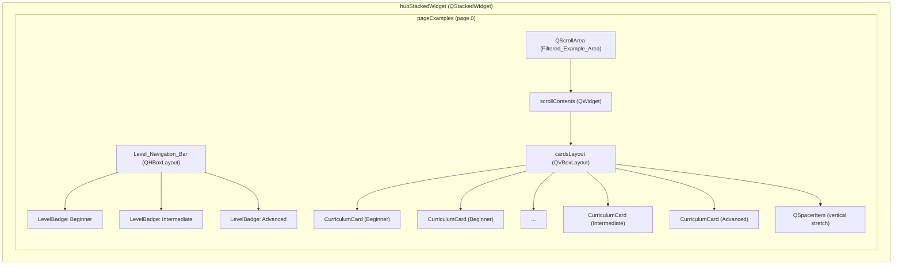
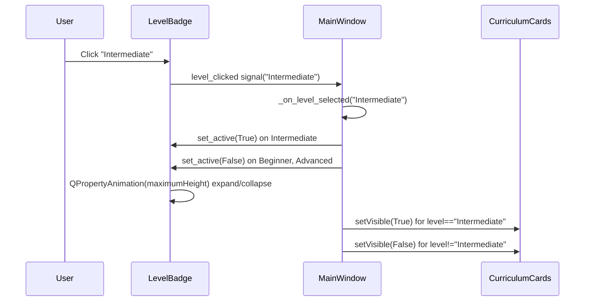

# Design Document: Examples Level Navigation

## Overview

This design replaces the flat `hubContentLayout` QVBoxLayout (which renders all 38 curriculum cards in a single scrolling list) with a level-based navigation system inside the Examples tab. Three animated `LevelBadge` widgets sit in a horizontal `Level_Navigation_Bar` at the top, each representing a difficulty level (Beginner, Intermediate, Advanced). Clicking a badge filters the `Filtered_Example_Area` QScrollArea below to show only matching `CurriculumCard` widgets. The active badge animates from a compact half-circle into a flag/ribbon shape using `QPropertyAnimation` on `maximumHeight`, while inactive badges shrink back to the half-circle form.

### Key Design Decisions

1. **LevelBadge as a standalone QWidget subclass** — encapsulates all animation, painting, and state logic. The badge manages its own `QPropertyAnimation` on `maximumHeight` to drive the expand/collapse transition, keeping the animation self-contained.
2. **Show/hide filtering instead of recreate** — `populate_curriculum_hub()` creates all CurriculumCards once, grouped by level in a dict. Level switching calls `setVisible(True/False)` on cards rather than destroying and recreating widgets, which is faster and avoids layout thrashing.
3. **QScrollArea replaces the flat QVBoxLayout** — the existing `hubContentLayout` inside `pageExamples` is replaced at runtime (in `__init__`) with a new layout containing the Level_Navigation_Bar and a QScrollArea. The `.ui` file is not modified; the restructuring happens in Python code.
4. **Dual resolution handled via a single `update_resolution(is_small)` method** on LevelBadge — called from `refresh_ui_resolution()`. This keeps resolution logic co-located with the widget.
5. **Translation keys added to `translations.py`** — `LVL_BEGINNER`, `LVL_INTERMEDIATE`, `LVL_ADVANCED` keys provide bilingual level names. Badge text updates via a `retranslate(strings)` method.

## Architecture

### Widget Hierarchy (Runtime)



### Interaction Flow



## Components and Interfaces

### 1. LevelBadge (QWidget)

A custom widget that renders as a half-circle indicator (inactive) or a flag/ribbon banner (active).

```python
class LevelBadge(QWidget):
    """Animated level badge with half-circle (inactive) / flag-ribbon (active) states."""
    
    level_clicked = pyqtSignal(str)  # emits level name e.g. "Beginner"
    
    def __init__(self, level_key: str, color: str, icon: str, parent=None):
        """
        Args:
            level_key: Internal level identifier ("Beginner", "Intermediate", "Advanced")
            color: Hex color string e.g. "#3b82f6"
            icon: Emoji string e.g. "⭐"
        """
    
    # --- Public API ---
    def set_active(self, active: bool) -> None:
        """Animate to active (flag/ribbon) or inactive (half-circle) state."""
    
    def set_count(self, count: int) -> None:
        """Update the example count displayed on the active badge."""
    
    def update_resolution(self, is_small: bool) -> None:
        """Resize badge dimensions for Standard vs Small resolution mode."""
    
    def retranslate(self, strings: dict) -> None:
        """Update displayed level name text from translation strings dict."""
```

**Internal state:**
- `self._active: bool` — current active/inactive state
- `self._level_key: str` — "Beginner" / "Intermediate" / "Advanced"
- `self._color: str` — hex color
- `self._icon: str` — emoji
- `self._count: int` — number of examples at this level
- `self._is_small: bool` — current resolution mode
- `self._anim: QPropertyAnimation` — animates `maximumHeight` property

**Animation mechanics:**
- Property animated: `maximumHeight` (QWidget property)
- Inactive height: `inactive_h` (Standard: 24px, Small: 19px)
- Active height: `active_h` (Standard: 56px, Small: 45px)
- Duration: 200ms
- Easing: `QEasingCurve.InOutCubic`

**Visual rendering via stylesheet:**

The badge uses dynamic stylesheet updates (not `paintEvent`) to render the two states. The half-circle top is achieved with `border-top-left-radius` and `border-top-right-radius` equal to half the widget width. The flag/ribbon bottom uses smaller `border-bottom-left-radius` and `border-bottom-right-radius` values.

### 2. Level_Navigation_Bar

Not a separate class — it's a `QHBoxLayout` created in `_setup_level_navigation()` containing three `LevelBadge` instances with stretch spacers between them for even distribution.

```python
# Created in MainWindow._setup_level_navigation()
self._level_badges: dict[str, LevelBadge]  # {"Beginner": badge, "Intermediate": badge, "Advanced": badge}
self._active_level: str  # Currently selected level, default "Beginner"
```

### 3. Filtered_Example_Area

A `QScrollArea` widget created in `_setup_level_navigation()`:

```python
self._examples_scroll = QScrollArea()
self._examples_scroll.setWidgetResizable(True)
self._examples_scroll.setHorizontalScrollBarPolicy(Qt.ScrollBarAlwaysOff)
self._examples_scroll.setFrameShape(QFrame.NoFrame)

self._scroll_contents = QWidget()
self._cards_layout = QVBoxLayout(self._scroll_contents)
self._examples_scroll.setWidget(self._scroll_contents)
```

### 4. Refactored populate_curriculum_hub()

```python
def populate_curriculum_hub(self):
    """Scan curriculum folder, group by level, create cards, apply active filter."""
    # 1. Clear existing cards from _cards_layout
    # 2. Scan curriculum/ directory, parse metadata
    # 3. Group files by level into dict: {"Beginner": [...], "Intermediate": [...], "Advanced": [...]}
    # 4. Store grouped metadata in self._curriculum_by_level
    # 5. Create CurriculumCard for each file, store in self._curriculum_cards: list[tuple[str, CurriculumCard]]
    #    where tuple is (level, card)
    # 6. Add all cards to _cards_layout
    # 7. Update badge counts via set_count()
    # 8. Apply current filter: _apply_level_filter()
```

```python
def _apply_level_filter(self):
    """Show/hide cards based on self._active_level."""
    for level, card in self._curriculum_cards:
        card.setVisible(level == self._active_level)
```

### 5. MainWindow Integration Points

New method `_setup_level_navigation()` called from `__init__` after `hubContentLayout` is found:

```python
def _setup_level_navigation(self):
    """Replace flat hubContentLayout with Level_Navigation_Bar + QScrollArea."""
    # 1. Get pageExamples widget from hubStackedWidget
    # 2. Remove existing hubContentLayout contents
    # 3. Create new QVBoxLayout on pageExamples:
    #    - Level_Navigation_Bar (QHBoxLayout with 3 LevelBadge widgets)
    #    - QScrollArea (Filtered_Example_Area)
    # 4. Connect LevelBadge.level_clicked signals to _on_level_selected()
    # 5. Set Beginner as default active level
```

New method `_on_level_selected(level: str)`:

```python
def _on_level_selected(self, level: str):
    """Handle level badge click — update active states and filter cards."""
    if level == self._active_level:
        return
    self._active_level = level
    for lvl, badge in self._level_badges.items():
        badge.set_active(lvl == level)
    self._apply_level_filter()
```

### 6. refresh_ui_resolution() Additions

Inside the existing `refresh_ui_resolution()` method, add after the hub content refresh:

```python
# Update Level Navigation Bar for resolution
if hasattr(self, '_level_badges'):
    for badge in self._level_badges.values():
        badge.update_resolution(is_small)
```

### 7. Translation Updates (retranslate_ui)

In the existing `retranslate_ui()` or equivalent method:

```python
if hasattr(self, '_level_badges'):
    for badge in self._level_badges.values():
        badge.retranslate(strings)
```

## Data Models

### LevelBadge Size Table

| Property | Standard (1280×800) | Small (1024×600) | Notes |
|:---|:---|:---|:---|
| **Inactive height** | 24px | 19px | Half-circle indicator |
| **Active height** | 56px | 45px | Full flag/ribbon |
| **Badge width** | 90px | 72px | Fixed width per badge |
| **Font size (name)** | 11px bold | 9px bold | Level name text |
| **Font size (count)** | 9px | 7px | Example count text |
| **Icon size** | 14px | 11px | Emoji font size |
| **Border radius (top)** | 45px | 36px | Half of width for half-circle |
| **Border radius (bottom)** | 8px | 6px | Slight rounding for flag tail |
| **Animation duration** | 200ms | 200ms | Same for both resolutions |

### LevelBadge Stylesheet Specifications

**Active state:**
```css
LevelBadge[active="true"] {
    background: {color};                    /* Full saturation level color */
    border-top-left-radius: {width/2}px;
    border-top-right-radius: {width/2}px;
    border-bottom-left-radius: 8px;
    border-bottom-right-radius: 8px;
    color: white;
    font-weight: bold;
}
```

**Inactive state:**
```css
LevelBadge[active="false"] {
    background: rgba({r}, {g}, {b}, 0.35);  /* Muted/semi-transparent */
    border-top-left-radius: {width/2}px;
    border-top-right-radius: {width/2}px;
    border-bottom-left-radius: {width/2}px;
    border-bottom-right-radius: {width/2}px;  /* Full circle when collapsed */
    color: transparent;                       /* Hide text in inactive state */
}
```

### Level Configuration Data

```python
LEVEL_CONFIG = {
    "Beginner":     {"color": "#3b82f6", "icon": "⭐", "trans_key": "LVL_BEGINNER"},
    "Intermediate": {"color": "#22c55e", "icon": "🚀", "trans_key": "LVL_INTERMEDIATE"},
    "Advanced":     {"color": "#f97316", "icon": "🏆", "trans_key": "LVL_ADVANCED"},
}
```

### Translation Keys (additions to translations.py)

```python
# English
"LVL_BEGINNER": "Beginner",
"LVL_INTERMEDIATE": "Intermediate",
"LVL_ADVANCED": "Advanced",

# Vietnamese
"LVL_BEGINNER": "Cơ bản",
"LVL_INTERMEDIATE": "Trung bình",
"LVL_ADVANCED": "Nâng cao",
```

### Curriculum Level Distribution (from metadata scan)

| Level | Count | Color |
|:---|:---|:---|
| Beginner | 14 | #3b82f6 (blue) |
| Intermediate | 13 | #22c55e (green) |
| Advanced | 11 | #f97316 (orange) |


## Correctness Properties

*A property is a characteristic or behavior that should hold true across all valid executions of a system — essentially, a formal statement about what the system should do. Properties serve as the bridge between human-readable specifications and machine-verifiable correctness guarantees.*

### Property 1: Level filter visibility invariant

*For any* set of curriculum cards with assigned levels, and *for any* selected active level, a card is visible if and only if its level matches the active level. Equivalently: the number of visible cards equals the number of cards whose level matches the active level, and every visible card has a level equal to the active level.

**Validates: Requirements 2.3, 2.4**

### Property 2: Badge count matches group size

*For any* set of curriculum metadata entries grouped by level, the count displayed on each LevelBadge equals the number of entries whose LEVEL field matches that badge's level key.

**Validates: Requirements 2.5**

### Property 3: Localized card text matches metadata

*For any* curriculum metadata entry containing both EN and VI fields (TITLE, TITLE_VI, DESC, DESC_VI), and *for any* language selection (EN or VI), the CurriculumCard created from that entry displays the title and description corresponding to the selected language's metadata field.

**Validates: Requirements 6.4**

## Error Handling

| Scenario | Handling |
|:---|:---|
| **No curriculum files found** | `populate_curriculum_hub()` returns early; Level_Navigation_Bar shows badges with count 0; Filtered_Example_Area is empty. |
| **Curriculum file missing LEVEL metadata** | `_parse_lesson_metadata()` returns empty LEVEL; default to `"Beginner"` (existing behavior preserved). |
| **Curriculum file missing TITLE_VI / DESC_VI** | Fall back to English TITLE / DESC fields (existing behavior in `populate_curriculum_hub()`). |
| **Invalid LEVEL value in metadata** | Cards with unrecognized levels are not shown under any badge. They are created but never made visible since no badge matches their level. |
| **QPropertyAnimation on deleted widget** | Animation is parented to the LevelBadge widget, so it is automatically cleaned up when the badge is destroyed. |
| **Resolution toggle during animation** | `update_resolution()` stops any running animation, then sets the new target heights directly before restarting if needed. |

## Testing Strategy

### Unit Tests (Example-Based)

Unit tests cover specific configurations, structural checks, and UI state transitions:

- **Badge initialization**: Verify 3 badges created with correct colors (#3b82f6, #22c55e, #f97316), correct order (Beginner, Intermediate, Advanced), and correct icons.
- **Default active level**: Verify Beginner is active on launch.
- **Active/inactive dimensions**: Verify `set_active(True)` targets active_h and `set_active(False)` targets inactive_h for both resolution modes.
- **Animation duration**: Verify animation duration is 200ms (within 150–300ms range).
- **QScrollArea configuration**: Verify `widgetResizable` is True, horizontal scrollbar is off, frame shape is NoFrame.
- **Resolution scaling**: Verify `update_resolution(True)` sets small dimensions (80% of standard) and `update_resolution(False)` sets standard dimensions.
- **Language labels**: Verify EN shows "Beginner"/"Intermediate"/"Advanced" and VI shows "Cơ bản"/"Trung bình"/"Nâng cao".
- **Load button preservation**: Verify CurriculumCard Load button is connected to `load_curriculum_example`.
- **Bidirectional animation**: Verify clicking a new badge collapses the old one and expands the new one.

### Property-Based Tests

Property-based tests use `hypothesis` (Python PBT library) with minimum 100 iterations per property:

- **Property 1 — Level filter visibility invariant**: Generate random lists of `(level, card_mock)` tuples with levels drawn from {"Beginner", "Intermediate", "Advanced"}, apply `_apply_level_filter()` for a randomly chosen active level, assert visible cards match exactly.
  - Tag: `Feature: examples-level-navigation, Property 1: Level filter visibility invariant`

- **Property 2 — Badge count matches group size**: Generate random curriculum metadata dicts with random LEVEL values from the 3 valid levels, group them, verify `set_count()` values match `len(group)`.
  - Tag: `Feature: examples-level-navigation, Property 2: Badge count matches group size`

- **Property 3 — Localized card text matches metadata**: Generate random metadata dicts with TITLE, TITLE_VI, DESC, DESC_VI fields (random non-empty strings), select a random language, verify the card displays the correct field.
  - Tag: `Feature: examples-level-navigation, Property 3: Localized card text matches metadata`

### Integration Tests

- **End-to-end level switching**: Launch the app, click each level badge, verify the correct cards appear and the scroll area updates.
- **Resolution toggle with level navigation**: Toggle resolution while a non-default level is active, verify badges and cards resize correctly and the active level is preserved.
- **Language switch with level navigation**: Switch language while browsing a level, verify badge text and card text update without losing the active level selection.
