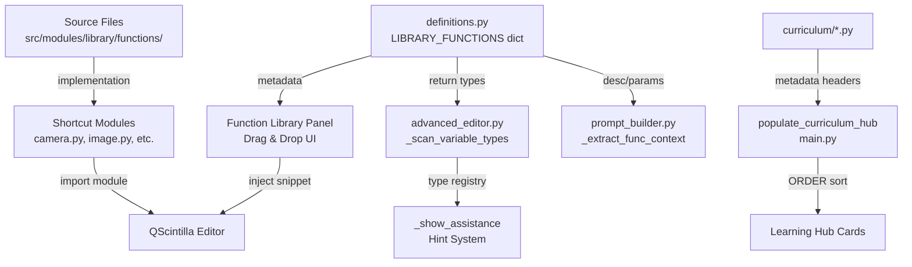

# Design Document: Expanded Function Library V3

## Overview

This design covers the V3 expansion of the AI Coding Lab's Function Library, adding 15 new function blocks across 6 categories, 12 new curriculum examples, and a curriculum file rename migration. The expansion follows the existing modular architecture: definitions in `definitions.py`, implementations in `src/modules/library/functions/`, re-exports via root-level shortcut modules, and integration with the hint system, AI Assistant Bot, and bilingual UI.

The design is organized around three pillars:
1. **Function Block Expansion** — 15 new blocks with bilingual metadata, type-safe returns, and hint system compatibility
2. **Curriculum Expansion** — 12 new examples across Beginner/Intermediate/Advanced levels
3. **Curriculum Migration** — Remove numeric prefixes from filenames, add ORDER metadata field

## Architecture

The existing architecture remains unchanged. New blocks plug into the established pipeline:



**Key architectural decisions:**
- All new functions are added to existing source files (no new modules) to maintain the current category-to-file mapping
- The hint system requires zero code changes — it dynamically reads `LIBRARY_FUNCTIONS` at runtime, so adding entries to the dict is sufficient
- The AI Assistant Bot's `_extract_func_context()` also reads from `LIBRARY_FUNCTIONS` dynamically — no changes needed
- The `_scan_variable_types()` regex pattern `\b([a-zA-Z_]\w*)\s*=\s*(?:\w+\.)?{f_name}\b` already handles `module.Function()` calls, so new blocks are auto-detected

## Components and Interfaces

### Component 1: Definitions Registry Expansion

**File:** `src/modules/library/definitions.py`

15 new entries added to `LIBRARY_FUNCTIONS` dict across 6 categories:

| Category | New Blocks | import_statement | source_module |
|---|---|---|---|
| Image Processing | `threshold_image`, `blend_images`, `split_channels`, `equalize_histogram`, `detect_contours` | `import image` | `src.modules.library.functions.image_processing` |
| Display & Dashboard | `Draw_Line`, `Draw_Text_Box`, `Stack_Images` | `import display` | `src.modules.library.functions.display_blocks` |
| Logic Operations | `Get_Timestamp`, `Compare_Values` | `import logic` | `src.modules.library.functions.logic_blocks` |
| Camera | `Set_Camera_Resolution`, `Capture_Snapshot` | `import camera` | `src.modules.library.functions.camera_blocks` |
| AI Vision Core | `Get_Detection_Count`, `Crop_Detection` | `import ai_vision` | `src.modules.library.functions.ai_vision_blocks` |
| Robotics | `Sweep_Servo` | `import robotics` | `src.modules.library.functions.robotics` |

Each entry follows the established schema:
```python
"function_name": {
    "desc": "English description",
    "desc_vi": "Vietnamese description",
    "params": [
        {"name": "param", "type": "Type", "desc": "EN desc", "desc_vi": "VI desc"}
    ],
    "returns": {"type": "Type", "desc": "EN desc", "desc_vi": "VI desc"},
    "usage": "module.function_name(param = default)",
    "import_statement": "import module",
    "source_func": "function_name",
    "source_module": "src.modules.library.functions.source_file",
}
```

### Component 2: Source File Implementations

Each new function is added to its corresponding existing source file:

**image_processing.py** — 5 new functions:
- `threshold_image(input_image, threshold=127, max_value=255)` → `cv2.threshold` wrapper, handles grayscale conversion
- `blend_images(image1, image2, alpha=0.5)` → `cv2.addWeighted` wrapper, auto-resizes image2 to match image1
- `split_channels(input_image)` → `cv2.split` wrapper, returns list of 3 single-channel images
- `equalize_histogram(input_image)` → `cv2.equalizeHist` wrapper, handles color via per-channel equalization
- `detect_contours(input_image)` → `cv2.findContours` + `cv2.drawContours`, returns image with contours drawn

**display_blocks.py** — 3 new functions:
- `Draw_Line(camera_frame, x1, y1, x2, y2, color='green')` → `cv2.line` wrapper with color name resolution
- `Draw_Text_Box(camera_frame, text, x, y, bg_color='blue', text_color='white')` → draws filled rectangle + `cv2.putText`
- `Stack_Images(image1, image2, direction='horizontal')` → `np.hstack`/`np.vstack` with auto-resize

**logic_blocks.py** — 2 new functions:
- `Get_Timestamp()` → `datetime.now().strftime("%Y-%m-%d %H:%M:%S")`
- `Compare_Values(value1, value2)` → returns `value1 == value2` as bool

**camera_blocks.py** — 2 new functions:
- `Set_Camera_Resolution(capture_camera, width=640, height=480)` → sets `CAP_PROP_FRAME_WIDTH/HEIGHT`
- `Capture_Snapshot(capture_camera, countdown=0)` → reads single frame with optional countdown print

**ai_vision_blocks.py** — 2 new functions:
- `Get_Detection_Count(results)` → extracts count from ONNX/Engine/YuNet result formats
- `Crop_Detection(camera_frame, results, index=0)` → crops bounding box region, returns None if index OOB

**robotics.py** (source) — 1 new function:
- `Sweep_Servo(pin='S1', start_angle=0, end_angle=180, step=10, delay=0.05)` → iterates angles calling `Set_Servo`

### Component 3: Shortcut Module Updates

Each root-level shortcut module gets new re-exports appended:

| Module | New Exports |
|---|---|
| `image.py` | `threshold_image`, `blend_images`, `split_channels`, `equalize_histogram`, `detect_contours` |
| `display.py` | `Draw_Line`, `Draw_Text_Box`, `Stack_Images` |
| `logic.py` | `Get_Timestamp`, `Compare_Values` |
| `camera.py` | `Set_Camera_Resolution`, `Capture_Snapshot` |
| `ai_vision.py` | `Get_Detection_Count`, `Crop_Detection` |
| `robotics.py` | `Sweep_Servo` |

### Component 4: Curriculum File Migration

**Step 1: Add ORDER field to `_parse_lesson_metadata()` in `main.py`**
- Add `ORDER` to the metadata parser regex/logic
- Parse as integer, default to `999` if missing

**Step 2: Update `populate_curriculum_hub()` sort logic**
- Primary sort: `LEVEL` group (Beginner → Intermediate → Advanced)
- Secondary sort: `ORDER` ascending within each level
- Tertiary sort: alphabetical filename (tiebreaker)

**Step 3: Rename existing 38 files**
- Remove numeric prefix: `1_face_detection.py` → `face_detection.py`
- Add `# ORDER: N` to each file's metadata header preserving current sequence

**Step 4: Update references**
- `agent.md` — update any curriculum filename references
- `.kiro/specs/` documents — update references
- Python source files — grep and update any hardcoded paths

### Component 5: New Curriculum Examples (12 files)

**Beginner (4):**
- `threshold_lab.py` — ORDER: 39, teaches `threshold_image`
- `image_blender.py` — ORDER: 40, teaches `blend_images` + `Load_Image`
- `channel_splitter.py` — ORDER: 41, teaches `split_channels` + `Stack_Images`
- `contour_finder.py` — ORDER: 42, teaches `detect_contours` + `threshold_image`

**Intermediate (4):**
- `face_crop_gallery.py` — ORDER: 43, teaches `Crop_Detection` + `Save_Frame`
- `smart_timestamp_logger.py` — ORDER: 44, teaches `Get_Timestamp` + `Get_Detection_Count`
- `side_by_side_filters.py` — ORDER: 45, teaches `Stack_Images` + image filters
- `contrast_enhancer.py` — ORDER: 46, teaches `equalize_histogram` + AI detection

**Advanced (4):**
- `smart_traffic_monitor.py` — ORDER: 47, teaches `Get_Detection_Count` + `Get_Timestamp` + ONNX
- `panoramic_servo_scanner.py` — ORDER: 48, teaches `Sweep_Servo` + AI detection (⚠️ ORC Hub required)
- `object_isolation_studio.py` — ORDER: 49, teaches `Crop_Detection` + `Stack_Images` + filters
- `hi_res_capture_station.py` — ORDER: 50, teaches `Set_Camera_Resolution` + `Capture_Snapshot`

Each file follows the established metadata header format:
```python
# TITLE: Example Title
# TITLE_VI: Tiêu đề tiếng Việt
# LEVEL: Beginner|Intermediate|Advanced
# ICON: 🔬
# COLOR: #22c55e|#eab308|#f97316
# DESC: English description.
# DESC_VI: Mô tả tiếng Việt.
# ORDER: 39
# ============================================================
```

## Data Models

### Function Block Definition Schema

```python
{
    "desc": str,           # English description (required)
    "desc_vi": str,        # Vietnamese description (required)
    "params": [            # Parameter list (may be empty)
        {
            "name": str,       # Parameter name matching function signature
            "type": str,       # Type from vocabulary (see below)
            "desc": str,       # English parameter description
            "desc_vi": str,    # Vietnamese parameter description
        }
    ],
    "returns": {
        "type": str,       # Return type from vocabulary
        "desc": str,       # English return description
        "desc_vi": str,    # Vietnamese return description
    },
    "usage": str,          # Snippet injected on drag (module.Function(param = default))
    "import_statement": str,  # Import line (e.g., "import image")
    "source_func": str,    # Function name in source file
    "source_module": str,  # Dotted module path
}
```

### Type Vocabulary (recognized by Hint System)

```
Image, Image (ndarray), Capture Object, AI Detector, AI Session, AI Model,
Array, Text (str), Number, Number (int), Number (float), Boolean, List,
Control Flow, None, Any, Check
```

### Return Type Mapping for New Blocks

| Block | Return Type |
|---|---|
| `threshold_image` | `Image (ndarray)` |
| `blend_images` | `Image (ndarray)` |
| `split_channels` | `List` |
| `equalize_histogram` | `Image (ndarray)` |
| `detect_contours` | `Image (ndarray)` |
| `Draw_Line` | `Image (ndarray)` |
| `Draw_Text_Box` | `Image (ndarray)` |
| `Stack_Images` | `Image (ndarray)` |
| `Get_Timestamp` | `Text (str)` |
| `Compare_Values` | `Boolean` |
| `Set_Camera_Resolution` | `None` |
| `Capture_Snapshot` | `Image (ndarray)` |
| `Get_Detection_Count` | `Number (int)` |
| `Crop_Detection` | `Image (ndarray)` |
| `Sweep_Servo` | `None` |

### Curriculum Metadata Schema

```python
# TITLE: str          # English title
# TITLE_VI: str       # Vietnamese title
# LEVEL: str          # "Beginner" | "Intermediate" | "Advanced"
# ICON: str           # Emoji icon
# COLOR: str          # Hex color (#22c55e / #eab308 / #f97316)
# DESC: str           # English description
# DESC_VI: str        # Vietnamese description
# ORDER: int          # Sort position within level group
```


## Correctness Properties

*A property is a characteristic or behavior that should hold true across all valid executions of a system — essentially, a formal statement about what the system should do. Properties serve as the bridge between human-readable specifications and machine-verifiable correctness guarantees.*

### Property 1: Return types use recognized Hint System vocabulary

*For any* new function block definition in the Definitions Registry, the `returns.type` string SHALL be a member of the recognized Hint System type vocabulary set (`Image`, `Image (ndarray)`, `Capture Object`, `AI Detector`, `AI Session`, `AI Model`, `Array`, `Text (str)`, `Number`, `Number (int)`, `Number (float)`, `Boolean`, `List`, `Control Flow`, `None`).

**Validates: Requirements 1.5, 2.5, 8.1**

### Property 2: Bilingual metadata completeness

*For any* new function block definition in the Definitions Registry, the entry SHALL have a non-empty `desc_vi` field, every item in its `params` list SHALL have a non-empty `desc_vi` field, and its `returns` dict SHALL have a non-empty `desc_vi` field.

**Validates: Requirements 7.1, 7.2, 7.3**

### Property 3: Curriculum metadata header completeness

*For any* curriculum example file (both existing and new), the metadata header SHALL contain all required fields (`TITLE`, `TITLE_VI`, `LEVEL`, `ICON`, `COLOR`, `DESC`, `DESC_VI`, `ORDER`) with non-empty values, and the `ORDER` field SHALL parse as a valid integer.

**Validates: Requirements 10.3, 11.3, 12.2, 14.1**

### Property 4: Compare_Values correctness

*For any* two Python values `a` and `b`, calling `Compare_Values(a, b)` SHALL return a `bool` that equals `a == b`.

**Validates: Requirements 3.5**

### Property 5: Sweep_Servo iteration sequence

*For any* valid `start_angle`, `end_angle` (both in 0–180), and positive `step`, calling `Sweep_Servo(pin, start_angle, end_angle, step, delay)` SHALL invoke `Set_Servo` with angles forming the sequence `[start_angle, start_angle+step, start_angle+2*step, ...]` up to and including `end_angle`, in ascending order.

**Validates: Requirements 6.5**

### Property 6: Image processing functions handle color and grayscale

*For any* new image processing function that accepts an `input_image` parameter, and *for any* valid image (either 3-channel BGR or single-channel grayscale), the function SHALL return a valid non-None result without raising an exception.

**Validates: Requirements 16.4**

### Property 7: Get_Timestamp returns valid datetime string

*For any* invocation of `Get_Timestamp()`, the returned value SHALL be a non-empty string that can be parsed as a valid datetime using the format `"%Y-%m-%d %H:%M:%S"`.

**Validates: Requirements 3.4**

## Error Handling

All new function implementations follow the established error handling pattern:

### Pattern: Friendly Prefixed Error Messages

Each function wraps its core logic in a try/except block and prints a `[Module_Name]` prefixed error message on failure, returning a safe default value:

```python
def threshold_image(input_image, threshold=127, max_value=255):
    """Apply binary thresholding to an image."""
    try:
        # ... core logic ...
    except Exception as e:
        print(f"[Image] Error in threshold_image: {e}")
        return None
```

### Safe Defaults by Return Type

| Return Type | Safe Default |
|---|---|
| `Image (ndarray)` | `None` |
| `List` | `[]` |
| `Text (str)` | `""` |
| `Number (int)` | `0` |
| `Boolean` | `False` |
| `None` | (no return) |

### Specific Error Cases

- **`blend_images`**: If images have different dimensions, auto-resize `image2` to match `image1` before blending. Print `[Image] Resizing image2 to match image1 dimensions.`
- **`Crop_Detection`**: If `index >= len(results)`, print `[AI Vision] Detection index {index} out of range (only {len(results)} detections found).` and return `None`.
- **`Stack_Images`**: If images have different heights (horizontal) or widths (vertical), auto-resize the smaller one. Print `[Display] Resizing images to match for stacking.`
- **`Sweep_Servo`**: If ORC Hub is not connected, print `[Robotics] ORC Hub not connected. Sweep cancelled.` and return immediately.
- **`Set_Camera_Resolution`**: If camera handle is None, print `[Camera] No camera initialized.` and return.
- **Image processing functions receiving grayscale input**: Auto-convert to grayscale if needed (for functions like `threshold_image`, `equalize_histogram`) or convert to BGR (for functions like `blend_images` that need color).

## Testing Strategy

### Unit Tests (Example-Based)

Unit tests verify specific structural and behavioral requirements:

1. **Definition Registry Structure** — Verify all 15 new entries exist in correct categories with correct fields
2. **Import/Usage Fields** — Verify each entry's `import_statement` and `usage` match the expected module prefix pattern
3. **Shortcut Module Re-exports** — Verify each root-level module exposes the new functions
4. **Source File Callability** — Verify each new function is importable and callable
5. **Curriculum File Existence** — Verify all 12 new files and 38 renamed files exist
6. **Curriculum Import Constraints** — Verify Beginner examples don't import ai_vision/robotics, Intermediate use 3+ categories, Advanced use 4+ categories
7. **AI Assistant Context Injection** — Verify `_extract_func_context()` finds new function names
8. **Crop_Detection OOB** — Verify returns None for out-of-bounds index
9. **Curriculum Rename Completeness** — Verify no `{digit}_*.py` files remain in curriculum/

### Property-Based Tests

Property-based tests verify universal properties across generated inputs. Using `hypothesis` (Python PBT library), minimum 100 iterations per property.

Each test is tagged with: `Feature: expanded-function-library-v3, Property {N}: {title}`

| Property | What's Generated | What's Verified |
|---|---|---|
| P1: Return type vocabulary | Random selection from all 15 new block definitions | `returns.type` is in the recognized vocabulary set |
| P2: Bilingual metadata | Random selection from all 15 new block definitions | `desc_vi`, `params[].desc_vi`, `returns.desc_vi` all non-empty |
| P3: Curriculum metadata | Random selection from all curriculum files | All 8 required header fields present, ORDER is int |
| P4: Compare_Values | Random pairs of ints, floats, strings, bools, None | Result equals Python `==` |
| P5: Sweep_Servo sequence | Random start/end angles (0–180), step (1–90) | Mocked Set_Servo called with correct angle sequence |
| P6: Color/grayscale handling | Random images (3-ch and 1-ch, various sizes) | Each image processing function returns non-None |
| P7: Get_Timestamp format | Multiple invocations | Result parses as `%Y-%m-%d %H:%M:%S` |

### Integration Tests

- **Hint System Registration** — Create code strings with new function calls, run `_scan_variable_types()`, verify correct type registration
- **Curriculum Hub Loading** — Verify `populate_curriculum_hub()` correctly sorts by ORDER within level groups after migration
- **Language Toggle** — Verify Vietnamese descriptions display when language is set to "vi"
