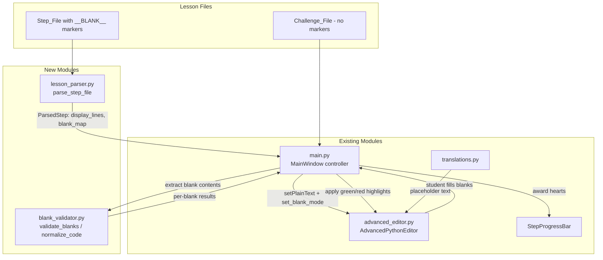

# Design Document: Fill-in-the-Blank Lessons

## Overview

This feature transforms the lesson system from free-form editing with whole-file comparison grading into a structured fill-in-the-blank approach. Lesson step files embed `# __BLANK__ expected_answer` markers on lines where students must provide code. The editor renders these as visually distinct editable slots while locking all other lines as read-only. Validation shifts from whole-file string matching to per-blank comparison with normalization, providing green/red visual feedback per blank. Challenge steps remain free-form. The existing hearts, hint, and solution systems integrate with the new per-blank validation.

### Key Design Decisions

1. **Parsing lives in a new `lesson_parser.py` module** — keeps `main.py` from growing further and isolates blank-marker logic for testability.
2. **Validation lives in a new `blank_validator.py` module** — pure-function design enables property-based testing of normalization and matching.
3. **Editor blank-slot protection reuses the existing `PROTECTED_INDICATOR` system** — the QScintilla indicator infrastructure already handles read-only regions; we extend it to protect entire non-blank lines rather than just parameter keys.
4. **No separate solution files needed for blank-marker steps** — expected answers are embedded in the step file itself, eliminating file synchronization issues.
5. **Pipe-separated alternatives** (`answer1 | answer2`) — supports multiple valid answers per blank without complex configuration.

## Architecture



### Data Flow

1. **Load**: `main.py.load_step()` → `lesson_parser.parse_step_file(path)` → returns `ParsedStep`
2. **Display**: `main.py` calls `editor.set_blank_mode(parsed_step)` → editor renders display lines, marks non-blank lines read-only, styles blank slots
3. **Edit**: Student types or drags into blank slots; editor enforces read-only on fixed lines
4. **Submit**: `main.py.submit_step()` → extracts blank contents from editor → `blank_validator.validate_blanks(blank_contents, expected_answers)` → returns `list[BlankResult]`
5. **Feedback**: `main.py` applies green/red markers via `editor.set_blank_feedback(results)` → hearts system processes overall pass/fail

## Components and Interfaces

### 1. `lesson_parser.py` (New Module — `src/modules/lesson_parser.py`)

```python
BLANK_MARKER = "# __BLANK__"

@dataclass
class BlankInfo:
    """Metadata for a single blank slot."""
    line_number: int          # 0-based line index in display code
    indentation: str          # Leading whitespace preserved from marker line
    expected_answers: list[str]  # One or more valid answers (pipe-separated)

@dataclass
class ParsedStep:
    """Result of parsing a step file."""
    display_lines: list[str]  # Lines to show in editor (blanks replaced with empty indented lines)
    blank_map: dict[int, BlankInfo]  # line_number → BlankInfo
    is_challenge: bool        # True if no blanks found (free-form mode)
    raw_content: str          # Original file content for challenge fallback

def parse_step_file(file_path: str) -> ParsedStep:
    """Parse a step file, extract blank markers, return display-ready content."""

def _parse_blank_line(line: str, line_number: int) -> BlankInfo | None:
    """Extract BlankInfo from a single line if it contains BLANK_MARKER."""
```

### 2. `blank_validator.py` (New Module — `src/modules/blank_validator.py`)

```python
@dataclass
class BlankResult:
    """Validation result for a single blank."""
    line_number: int
    is_correct: bool
    student_answer: str
    expected_answers: list[str]

def normalize_code(code: str) -> str:
    """Normalize code string: strip, collapse whitespace, standardize spacing
    around operators, parentheses, commas, and equals signs."""

def validate_blank(student_input: str, expected_answers: list[str]) -> bool:
    """Check if normalized student input matches any normalized expected answer."""

def validate_blanks(
    blank_contents: dict[int, str],
    blank_map: dict[int, BlankInfo]
) -> list[BlankResult]:
    """Validate all blanks and return per-blank results."""
```

### 3. `advanced_editor.py` — Extensions to `AdvancedPythonEditor`

New methods and indicators added to the existing class:

```python
# New indicator IDs (added alongside existing BLANK_INDICATOR=12, PROTECTED_INDICATOR=13)
FIXED_LINE_INDICATOR = 14    # Marks entire non-blank lines as read-only
BLANK_SLOT_INDICATOR = 15    # Marks blank slot lines with distinct styling
FEEDBACK_CORRECT = 16        # Green background for correct blanks
FEEDBACK_INCORRECT = 17      # Red background for incorrect blanks

# New instance state
self._blank_mode = False           # True when in fill-in-blank mode
self._blank_lines: set[int] = set()  # Set of line numbers that are blank slots
self._fixed_lines: set[int] = set()  # Set of line numbers that are read-only

def set_blank_mode(self, parsed_step: ParsedStep) -> None:
    """Configure editor for fill-in-blank mode: set text, mark fixed/blank lines."""

def exit_blank_mode(self) -> None:
    """Return editor to normal free-form editing mode."""

def get_blank_contents(self) -> dict[int, str]:
    """Extract current text from each blank slot line, keyed by line number."""

def set_blank_feedback(self, results: list[BlankResult]) -> None:
    """Apply green/red background indicators based on validation results."""

def clear_blank_feedback(self, line: int) -> None:
    """Clear feedback highlight on a specific line (called on edit)."""

def fill_blanks_with_answers(self, blank_map: dict[int, BlankInfo]) -> None:
    """Populate all blank slots with their first expected answer (for Solution button)."""

def _is_blank_line(self, line: int) -> bool:
    """Check if a line is a blank slot."""

def _is_fixed_line(self, line: int) -> bool:
    """Check if a line is a fixed (read-only) line."""
```

### 4. `main.py` — Controller Changes

Modified methods in `MainWindow`:

```python
def load_step(self, step_num):
    """Modified: uses lesson_parser for blank-marker steps, falls back to
    free-form for challenge steps."""

def submit_step(self):
    """Modified: uses blank_validator for per-blank validation when in blank mode,
    falls back to whole-file comparison for challenge steps."""

def _show_solution_for_blanks(self):
    """New: populates blank slots with expected answers when Solution button clicked."""

def _on_blank_edited(self, line: int):
    """New: clears feedback highlight when student edits a blank slot."""
```

### 5. `translations.py` — New Keys

```python
# English
"BLANK_PLACEHOLDER": "Type or drop code here...",
"BLANK_CORRECT": "✅ Correct!",
"BLANK_INCORRECT": "❌ Try again",
"BLANK_ALL_CORRECT": "All blanks correct!",
"BLANK_SOME_WRONG": "{} of {} blanks incorrect",

# Vietnamese
"BLANK_PLACEHOLDER": "Nhập hoặc kéo thả code vào đây...",
"BLANK_CORRECT": "✅ Đúng rồi!",
"BLANK_INCORRECT": "❌ Thử lại",
"BLANK_ALL_CORRECT": "Tất cả đều đúng!",
"BLANK_SOME_WRONG": "{} trên {} ô chưa đúng",
```

## Data Models

### Step File Format (Before → After)

**Before** (current free-form with TODO comments):
```python
# Step 1: Start the camera
# TODO: Initialize the camera


print("[OK] Camera is ready!")
```

**After** (fill-in-the-blank with embedded answers):
```python
# Step 1: Start the camera
# __BLANK__ capture_camera = camera.Init_Camera()

print("[OK] Camera is ready!")
```

### Blank Marker Syntax

```
# __BLANK__ <expected_answer>
# __BLANK__ <answer1> | <answer2> | <answer3>
```

- The `# __BLANK__` prefix is case-sensitive and must start at the line's indentation level
- Everything after `# __BLANK__ ` (note trailing space) is the expected answer
- Pipe `|` separates alternative valid answers; each alternative is trimmed
- Indentation before `#` is preserved for the blank slot

### ParsedStep Data Structure

| Field | Type | Description |
|-------|------|-------------|
| `display_lines` | `list[str]` | Lines shown in editor; blank marker lines replaced with indentation-only empty lines |
| `blank_map` | `dict[int, BlankInfo]` | Maps 0-based line number → blank metadata |
| `is_challenge` | `bool` | `True` if file has zero blank markers |
| `raw_content` | `str` | Original file text (used for challenge fallback) |

### BlankInfo Data Structure

| Field | Type | Description |
|-------|------|-------------|
| `line_number` | `int` | 0-based line index in display code |
| `indentation` | `str` | Whitespace prefix from original marker line |
| `expected_answers` | `list[str]` | Valid answers; first is the "canonical" answer shown by Solution button |

### BlankResult Data Structure

| Field | Type | Description |
|-------|------|-------------|
| `line_number` | `int` | 0-based line index |
| `is_correct` | `bool` | Whether student answer matched any expected answer |
| `student_answer` | `str` | What the student typed (raw) |
| `expected_answers` | `list[str]` | The valid answers for reference |

### Normalization Rules (for `normalize_code`)

1. Strip leading/trailing whitespace
2. Collapse multiple spaces to single space
3. Remove spaces around `=` in keyword arguments: `param = value` → `param=value`
4. Remove spaces inside parentheses: `( x )` → `(x)`
5. Remove spaces after commas then add single space: `a,b` → `a, b` and `a ,  b` → `a, b`
6. Case-sensitive comparison (Python is case-sensitive)


## Correctness Properties

*A property is a characteristic or behavior that should hold true across all valid executions of a system — essentially, a formal statement about what the system should do. Properties serve as the bridge between human-readable specifications and machine-verifiable correctness guarantees.*

### Property 1: Parsing round-trip preserves blank markers

*For any* step file containing one or more `# __BLANK__` marker lines (with arbitrary indentation, single or pipe-separated answers), parsing with `parse_step_file` SHALL produce a `ParsedStep` where:
- `blank_map` contains an entry for every blank marker line
- `display_lines` at each blank position contains only the original indentation (whitespace-only)
- Each `BlankInfo.indentation` matches the leading whitespace of the original marker line
- Each `BlankInfo.expected_answers` contains all pipe-separated alternatives, trimmed
- The number of `display_lines` equals the number of lines in the original file

**Validates: Requirements 1.1, 1.2, 1.4, 1.5, 1.6**

### Property 2: Challenge detection is correct

*For any* step file content, `parse_step_file` SHALL set `is_challenge = True` if and only if the file contains zero `# __BLANK__` marker lines. Conversely, if the file contains at least one marker, `is_challenge` SHALL be `False`.

**Validates: Requirements 1.3**

### Property 3: Blank validation matches any valid alternative

*For any* student input string and any non-empty list of expected answer strings, `validate_blank(student_input, expected_answers)` SHALL return `True` if and only if `normalize_code(student_input)` equals `normalize_code(answer)` for at least one answer in the expected list.

**Validates: Requirements 5.1, 5.3**

### Property 4: Code normalization is idempotent

*For any* code string, applying `normalize_code` twice SHALL produce the same result as applying it once: `normalize_code(normalize_code(s)) == normalize_code(s)`.

**Validates: Requirements 5.2**

### Property 5: Step correctness requires all blanks correct

*For any* set of `BlankResult` objects, the step SHALL be reported as correct if and only if every `BlankResult.is_correct` is `True`. If any single blank is incorrect, the step is incorrect.

**Validates: Requirements 5.4**

## Error Handling

| Scenario | Handling |
|----------|----------|
| Step file not found | `load_step` logs error to console, does not crash. Editor remains in current state. |
| Step file has malformed `# __BLANK__` line (no answer after marker) | `_parse_blank_line` treats the line as having an empty expected answer `[""]`. Validator will accept only empty input. Logged as warning. |
| Step file has encoding issues | `parse_step_file` reads with `utf-8` encoding and `errors='replace'`. Logs warning if replacement characters found. |
| Student submits with empty blank slots | `validate_blank` compares empty string against expected answers. Will be marked incorrect unless expected answer is also empty. |
| Drag-and-drop on a line that doesn't exist | `dropEvent` bounds-checks line number against `_blank_lines` set. Rejects drop silently. |
| Solution file missing for challenge step | Existing behavior preserved: logs warning, treats as correct to avoid blocking student. |
| Language switch during active lesson | `load_step` is re-called with new language path. If new language file is missing, falls back to English file and logs warning. |
| `blank_map` and editor line count mismatch (e.g., after unexpected edit) | `get_blank_contents` validates line numbers against current editor line count. Skips out-of-range lines with warning. |

## Testing Strategy

### Property-Based Tests (using `hypothesis` for Python)

Each correctness property is implemented as a single property-based test with minimum 100 iterations.

| Property | Test File | Generator Strategy |
|----------|-----------|-------------------|
| Property 1: Parsing round-trip | `tests/test_lesson_parser_props.py` | Generate random step file content: mix of comment lines, code lines, and `# __BLANK__` lines with random indentation (0/4/8/12 spaces), random answer text, and random pipe-separated alternatives (1-4 answers). |
| Property 2: Challenge detection | `tests/test_lesson_parser_props.py` | Generate random Python-like file content. Parameterize: with zero blank markers (expect `is_challenge=True`) and with 1+ markers (expect `is_challenge=False`). |
| Property 3: Validation matches alternatives | `tests/test_blank_validator_props.py` | Generate random student input strings and lists of 1-5 expected answers. Include cases with whitespace variations around operators and parentheses. |
| Property 4: Normalization idempotence | `tests/test_blank_validator_props.py` | Generate arbitrary strings including Python code with operators (`=`, `(`, `)`, `,`), varying whitespace, and edge cases (empty string, all-whitespace). |
| Property 5: All-correct aggregation | `tests/test_blank_validator_props.py` | Generate lists of 1-10 `BlankResult` objects with random `is_correct` values. Verify aggregate matches `all()`. |

Tag format: `# Feature: fill-in-blank-lessons, Property N: <property_text>`

### Unit Tests (example-based)

| Test Area | Test File | Key Cases |
|-----------|-----------|-----------|
| Parser edge cases | `tests/test_lesson_parser.py` | Empty file, file with only comments, file with only blank markers, marker at first/last line, marker with no answer text |
| Validator edge cases | `tests/test_blank_validator.py` | Empty student input, whitespace-only input, exact match, match with extra spaces, no match, case sensitivity |
| Normalization specifics | `tests/test_blank_validator.py` | `param = value` → `param=value`, `( x )` → `(x)`, `a,b` → `a, b`, multiple spaces collapsed |
| Editor blank mode | `tests/test_editor_blanks.py` | Fixed line protection, blank line editability, cursor redirect from fixed to blank, drag-drop acceptance/rejection |
| Hearts integration | `tests/test_hearts_integration.py` | Full heart (no hint), half heart (hint used), zero hearts (solution used), error count thresholds |
| Bilingual | `tests/test_bilingual.py` | EN/VI placeholder text, EN/VI file loading, language switch reload |

### Integration Tests

| Test Area | Description |
|-----------|-------------|
| Full lesson flow | Load lesson → fill blanks → submit → verify hearts → navigate to next step |
| Challenge fallback | Load challenge step → verify free-form mode → submit with whole-file comparison |
| Solution button | Click Solution → verify all blanks populated → submit → verify 0 hearts |
| Drag-and-drop | Drag function block → verify drop on blank accepted, drop on fixed rejected |
| Language switch | Start lesson in EN → switch to VI → verify step reloads with VI content |
