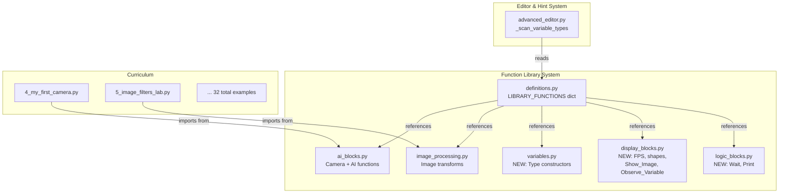
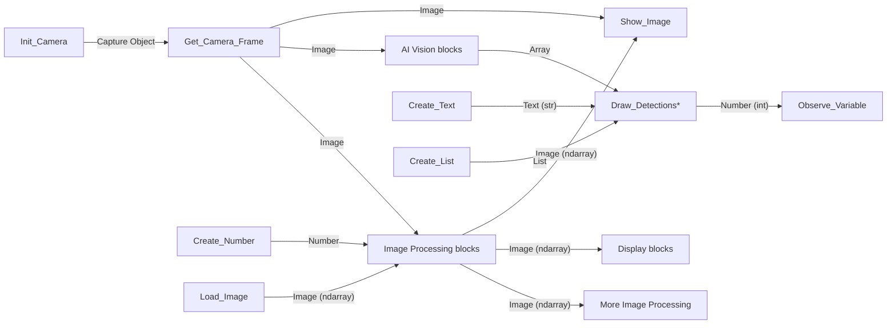

# Design Document: Library Full Examples

## Overview

This design expands the AI Coding Lab's Function Library with new blocks across 6 categories and creates 32 curriculum example programs (13 beginner, 10 intermediate, 9 advanced — plus the 3 existing). The expansion adds a new **Variables** category (including a `Create_List` block for list-typed parameters), extends Camera/Image Processing/Display/Logic categories with new blocks, adds separated display blocks (`Show_Image` and `Observe_Variable`) as granular alternatives to `Update_Dashboard`, and creates a comprehensive curriculum that teaches students progressively from basic camera concepts through AI detection to complex multi-category integrations. New curriculum examples use the separated display blocks to teach separation of concerns.

### Key Design Decisions

1. **New function implementations** go into existing source files (`ai_blocks.py`, `image_processing.py`) plus two new files (`variables.py`, `display_blocks.py`, `logic_blocks.py`) to maintain separation of concerns.
2. **Variables category** uses trivial identity functions (`Create_Text`, `Create_Number`, `Create_Decimal`, `Create_Boolean`, `Create_List`) that simply return their input — the real value is in the type metadata that feeds the hint system.
3. **All new blocks** use the existing type vocabulary recognized by `_scan_variable_types()` so no changes to the hint system scanner are needed.
4. **Curriculum examples** follow the existing metadata header format and sequential numbering starting at `4_*.py`.
5. **Separated display blocks**: New `Show_Image` and `Observe_Variable` blocks provide granular alternatives to the combined `Update_Dashboard`. New curriculum examples use the separated blocks to teach separation of concerns. `Update_Dashboard` is kept as-is for backward compatibility with existing examples.

## Architecture

### System Context



### Type Chain Flow

The hint system's `_scan_variable_types()` uses a 3-pass approach:
1. **Pass 1**: Matches `var = FunctionName(...)` against `LIBRARY_FUNCTIONS` → registers `var` with the function's `returns.type`
2. **Pass 2**: Matches list literals `var = [...]` → registers as `"List"`
3. **Pass 3**: Matches string/number literals → registers as `"Text (str)"` or `"Number"`

The `_show_assistance()` method then normalizes types by splitting on `"("` and comparing prefixes (e.g., `"Image (ndarray)"` → `"Image"` matches `"Image"` parameter type). This means all new blocks must use types from the existing vocabulary.



## Components and Interfaces

### New Source Files

#### 1. `src/modules/library/functions/variables.py`

Trivial identity functions that exist solely to provide typed return values for the hint system.

```python
def Create_Text(value="Hello"):
    """Create a text string variable. Returns: Text (str)"""
    return str(value)

def Create_Number(value=0):
    """Create an integer variable. Returns: Number"""
    return int(value)

def Create_Decimal(value=0.0):
    """Create a floating-point variable. Returns: Number (float)"""
    return float(value)

def Create_Boolean(value=True):
    """Create a boolean variable. Returns: Boolean"""
    return bool(value)

def Create_List(value=None):
    """Create a list variable. Returns: List"""
    if value is None:
        return []
    return list(value)
```

#### 2. `src/modules/library/functions/display_blocks.py`

New display/visualization functions.

```python
import cv2
import time
import base64
import sys

_prev_time = 0  # module-level state for FPS calculation

def Show_FPS(camera_frame):
    """Calculate and overlay FPS on the frame. Returns the annotated frame."""
    global _prev_time
    current_time = time.time()
    fps = 1.0 / (current_time - _prev_time) if _prev_time > 0 else 0
    _prev_time = current_time
    cv2.putText(camera_frame, f"FPS: {fps:.1f}", (10, 30),
                cv2.FONT_HERSHEY_SIMPLEX, 0.7, (0, 255, 0), 2)
    return camera_frame

def Show_Image(camera_frame):
    """Stream a camera frame to the Live Feed panel."""
    if camera_frame is not None:
        ok, buffer = cv2.imencode('.jpg', camera_frame, [cv2.IMWRITE_JPEG_QUALITY, 70])
        if ok:
            img_b64 = base64.b64encode(buffer).decode('utf-8')
            print(f"IMG:{img_b64}")
    sys.stdout.flush()

def Observe_Variable(var_name="Result", var_value=None):
    """Display a variable's value in the Results panel."""
    print(f"VAR:{var_name}:{var_value}")
    sys.stdout.flush()

def Draw_Rectangle(camera_frame, x=0, y=0, width=100, height=100, color="green"):
    """Draw a colored rectangle on the frame."""
    color_map = {"green": (0,255,0), "red": (0,0,255), "blue": (255,0,0),
                 "yellow": (0,255,255), "white": (255,255,255)}
    bgr = color_map.get(color.lower(), (0,255,0))
    cv2.rectangle(camera_frame, (int(x), int(y)),
                  (int(x)+int(width), int(y)+int(height)), bgr, 2)
    return camera_frame

def Draw_Circle(camera_frame, center_x=0, center_y=0, radius=50, color="green"):
    """Draw a colored circle on the frame."""
    color_map = {"green": (0,255,0), "red": (0,0,255), "blue": (255,0,0),
                 "yellow": (0,255,255), "white": (255,255,255)}
    bgr = color_map.get(color.lower(), (0,255,0))
    cv2.circle(camera_frame, (int(center_x), int(center_y)), int(radius), bgr, 2)
    return camera_frame
```

#### 3. `src/modules/library/functions/logic_blocks.py`

Logic utility functions.

```python
import time

def Wait_Seconds(seconds=1.0):
    """Pause execution for the specified number of seconds."""
    time.sleep(float(seconds))

def Print_Message(message="Hello!"):
    """Print a message to the console output."""
    print(message)
```

### Extended Existing Files

#### 4. New functions in `ai_blocks.py` (Camera category)

```python
def Save_Frame(camera_frame, file_path="snapshot.jpg"):
    """Save a camera frame to disk as an image file."""
    if camera_frame is None:
        print("ERROR: No frame to save.")
        return
    cv2.imwrite(file_path, camera_frame)
    print(f"[OK] Frame saved to {file_path}")

def Load_Image(file_path="image.jpg"):
    """Load an image from disk. Returns the image or None if not found."""
    if not os.path.exists(file_path):
        print(f"ERROR: File '{file_path}' not found!")
        return None
    img = cv2.imread(file_path)
    if img is None:
        print(f"ERROR: Could not read '{file_path}' as an image.")
        return None
    print(f"[OK] Image loaded from {file_path}")
    return img
```

#### 5. New functions in `image_processing.py`

```python
def adjust_brightness(input_image, factor=1.5):
    """Adjust image brightness by a factor. Clamps to 0-255."""
    adjusted = np.clip(input_image.astype(np.float32) * float(factor), 0, 255)
    return adjusted.astype(np.uint8)

def rotate_image(input_image, angle=90):
    """Rotate image around center without cropping."""
    h, w = input_image.shape[:2]
    center = (w // 2, h // 2)
    M = cv2.getRotationMatrix2D(center, float(angle), 1.0)
    cos, sin = abs(M[0, 0]), abs(M[0, 1])
    new_w, new_h = int(h * sin + w * cos), int(h * cos + w * sin)
    M[0, 2] += (new_w - w) / 2
    M[1, 2] += (new_h - h) / 2
    return cv2.warpAffine(input_image, M, (new_w, new_h))

def crop_image(input_image, x=0, y=0, width=100, height=100):
    """Crop a rectangular region from the image."""
    return input_image[int(y):int(y)+int(height), int(x):int(x)+int(width)]

def draw_text(input_image, text="Hello", x=10, y=30):
    """Draw text on the image at the specified position."""
    cv2.putText(input_image, str(text), (int(x), int(y)),
                cv2.FONT_HERSHEY_SIMPLEX, 0.7, (255, 255, 255), 2)
    return input_image

def convert_to_hsv(input_image):
    """Convert a BGR image to HSV color space."""
    return cv2.cvtColor(input_image, cv2.COLOR_BGR2HSV)
```

### Definitions Registry Updates

The `LIBRARY_FUNCTIONS` dict in `definitions.py` will be updated with:

| Category | New Blocks | Count |
|---|---|---|
| **Variables** (NEW) | `Create_Text`, `Create_Number`, `Create_Decimal`, `Create_Boolean`, `Create_List` | 5 |
| **Camera** | `Save_Frame`, `Load_Image` | 2 |
| **Image Processing** | `adjust_brightness`, `rotate_image`, `crop_image`, `draw_text`, `convert_to_hsv` | 5 |
| **Display & Dashboard** | `Show_FPS`, `Draw_Rectangle`, `Draw_Circle`, `Show_Image`, `Observe_Variable` | 5 |
| **Logic Operations** | `Wait_Seconds`, `Repeat_N_Times`, `Print_Message` | 3 |
| **Total new blocks** | | **20** |

Each entry follows the existing schema: `desc`, `params` (list of `{name, type, desc}`), `returns` (`{type, desc}`), `usage`, `import_statement`, `source_func`, `source_module`.

`Repeat_N_Times` is a control-flow snippet (like `Loop_Forever` and `If_Condition`) with `source_func: None`, `source_module: None`, `import_statement: ""`.

### New Display & Dashboard Registry Entries

```python
"Show_Image": {
    "desc": "Stream a camera frame to the Live Feed panel",
    "params": [
        {"name": "camera_frame", "type": "Image", "desc": "The frame to stream to 'Live Feed'"},
    ],
    "returns": {"type": "None", "desc": "Streams image to stdout via IMG protocol"},
    "usage": "Show_Image(camera_frame = None)",
    "import_statement": "from src.modules.library.functions.display_blocks import Show_Image",
    "source_func": "Show_Image",
    "source_module": "src.modules.library.functions.display_blocks",
},
"Observe_Variable": {
    "desc": "Display a variable's value in the Results panel",
    "params": [
        {"name": "var_name", "type": "Text (str)", "desc": "Name of variable to track in Results panel"},
        {"name": "var_value", "type": "Any", "desc": "Value to show in Results panel"},
    ],
    "returns": {"type": "None", "desc": "Streams variable to stdout via VAR protocol"},
    "usage": "Observe_Variable(var_name = 'Result', var_value = None)",
    "import_statement": "from src.modules.library.functions.display_blocks import Observe_Variable",
    "source_func": "Observe_Variable",
    "source_module": "src.modules.library.functions.display_blocks",
},
```

These are added to the existing `"Display & Dashboard"` category alongside `Draw_Detections`, `Draw_Detections_MultiClass`, `Draw_Engine_Detections`, `Update_Dashboard`, `Show_FPS`, `Draw_Rectangle`, and `Draw_Circle`. The existing `Update_Dashboard` block is kept unchanged for backward compatibility.

### Curriculum Example File Organization

All 32 examples follow sequential numbering. Existing files (1–3) are untouched.

| # | Name | Level | Categories Used | Display Approach |
|---|---|---|---|---|
| 4 | `4_my_first_camera.py` | Beginner | Camera, Display | `Show_Image` |
| 5 | `5_image_filters_lab.py` | Beginner | Camera, Image Processing, Display | `Show_Image` |
| 6 | `6_save_load_pictures.py` | Beginner | Camera, Display | `Show_Image` |
| 7 | `7_mirror_selfie_mode.py` | Beginner | Camera, Image Processing, Display | `Show_Image` |
| 8 | `8_brightness_controller.py` | Beginner | Camera, Variables, Image Processing, Display | `Show_Image` + `Observe_Variable` |
| 9 | `9_photo_rotator.py` | Beginner | Camera, Variables, Image Processing, Display | `Show_Image` + `Observe_Variable` |
| 10 | `10_text_overlay_studio.py` | Beginner | Camera, Variables, Image Processing, Display | `Show_Image` |
| 11 | `11_shape_drawing_canvas.py` | Beginner | Camera, Display | `Show_Image` |
| 12 | `12_edge_detection_explorer.py` | Beginner | Camera, Variables, Image Processing, Display | `Show_Image` + `Observe_Variable` |
| 13 | `13_color_space_explorer.py` | Beginner | Camera, Image Processing, Display | `Show_Image` |
| 14 | `14_photo_crop_frame.py` | Beginner | Camera, Variables, Image Processing, Display | `Show_Image` |
| 15 | `15_blur_intensity_lab.py` | Beginner | Camera, Variables, Image Processing, Display | `Show_Image` + `Observe_Variable` |
| 16 | `16_grayscale_converter.py` | Beginner | Camera, Image Processing, Display | `Show_Image` |
| 17 | `17_smart_face_counter.py` | Intermediate | Camera, AI Vision, Display, Logic, Variables | `Show_Image` + `Observe_Variable` |
| 18 | `18_image_processing_pipeline.py` | Intermediate | Camera, Image Processing, Display | `Show_Image` + `Observe_Variable` |
| 19 | `19_color_explorer_hsv.py` | Intermediate | Camera, Image Processing, Display | `Show_Image` |
| 20 | `20_face_triggered_filter.py` | Intermediate | Camera, AI Vision, Image Processing, Display, Logic | `Show_Image` + `Observe_Variable` |
| 21 | `21_object_counter_alert.py` | Intermediate | Camera, AI Vision, Display, Logic | `Show_Image` + `Observe_Variable` |
| 22 | `22_fps_performance_monitor.py` | Intermediate | Camera, Image Processing, Display | `Show_Image` |
| 23 | `23_face_detection_annotations.py` | Intermediate | Camera, AI Vision, Image Processing, Display | `Show_Image` + `Observe_Variable` |
| 24 | `24_timed_photo_capture.py` | Intermediate | Camera, AI Vision, Display, Logic | `Show_Image` |
| 25 | `25_repeat_capture_series.py` | Intermediate | Camera, Image Processing, Display, Logic | `Show_Image` |
| 26 | `26_custom_object_detector.py` | Intermediate | Camera, AI Vision, Display | `Show_Image` + `Observe_Variable` |
| 27 | `27_security_camera.py` | Advanced | Camera, AI Vision, Image Processing, Display, Logic | `Show_Image` + `Observe_Variable` |
| 28 | `28_smart_photo_booth.py` | Advanced | Camera, AI Vision, Image Processing, Display, Logic | `Show_Image` + `Observe_Variable` |
| 29 | `29_ai_image_gallery.py` | Advanced | Camera, AI Vision, Image Processing, Display, Logic | `Show_Image` + `Observe_Variable` |
| 30 | `30_face_following_robot.py` | Advanced | Camera, AI Vision, Display, Logic, Robotics | `Show_Image` + `Observe_Variable` |
| 31 | `31_multi_model_comparison.py` | Advanced | Camera, AI Vision, Display, Variables | `Show_Image` + `Observe_Variable` |
| 32 | `32_object_tracker_stats.py` | Advanced | Camera, AI Vision, Image Processing, Display, Logic, Variables | `Show_Image` + `Observe_Variable` |
| 33 | `33_smart_doorbell.py` | Advanced | Camera, AI Vision, Image Processing, Display, Logic | `Show_Image` + `Observe_Variable` |
| 34 | `34_robot_obstacle_avoider.py` | Advanced | Camera, AI Vision, Display, Logic, Robotics | `Show_Image` + `Observe_Variable` |
| 35 | `35_night_vision_effect.py` | Advanced | Camera, Image Processing, Display | `Show_Image` |

| 36 | `36_face_attendance_logger.py` | Advanced | Camera, AI Vision, Display, Logic, Variables | `Show_Image` + `Observe_Variable` |
| 37 | `37_ai_art_filter.py` | Advanced | Camera, AI Vision, Image Processing, Display, Logic | `Show_Image` |
| 38 | `38_motor_speed_dashboard.py` | Advanced | Camera, Display, Variables, Robotics | `Show_Image` + `Observe_Variable` |

### Curriculum Metadata Header Format

Every example file uses this exact header format (matching existing `1_face_detection.py`):

```python
# TITLE: English Title
# TITLE_VI: Vietnamese Title
# LEVEL: Beginner|Intermediate|Advanced
# ICON: 🎯
# COLOR: #hexcolor
# DESC: English description.
# DESC_VI: Vietnamese description.
# ============================================================
```

Color conventions by level:
- **Beginner**: `#3b82f6` (Blue)
- **Intermediate**: `#22c55e` (Green)
- **Advanced**: `#f97316` (Orange)

Icon is chosen per-example to reflect the topic.

## Data Models

### Function Block Schema (existing, unchanged)

Each entry in `LIBRARY_FUNCTIONS[category]["functions"][name]` follows:

```python
{
    "desc": str,           # One-line description
    "params": [            # List of parameter descriptors
        {
            "name": str,   # Parameter name (matches Python arg name)
            "type": str,   # Type string from recognized vocabulary
            "desc": str,   # Human-readable description
        }
    ],
    "returns": {
        "type": str,       # Return type from recognized vocabulary
        "desc": str,       # Human-readable description
    },
    "usage": str,          # Snippet injected into editor on drag
    "import_statement": str,  # Import line prepended to editor
    "source_func": str|None,  # Function name for inspect.getsource
    "source_module": str|None, # Dotted module path
}
```

### Category Schema (existing, unchanged)

```python
LIBRARY_FUNCTIONS[category_name] = {
    "color": str,    # Hex color for UI category header
    "icon": str,     # Emoji icon for category
    "functions": {   # Dict of function block entries
        "FunctionName": { ... }
    }
}
```

### New Variables Category Entry

```python
"Variables": {
    "color": "#14b8a6",  # Teal 500
    "icon": "📦",
    "functions": {
        "Create_Text": {
            "desc": "Create a text string variable",
            "params": [{"name": "value", "type": "Text (str)", "desc": "The text value to store"}],
            "returns": {"type": "Text (str)", "desc": "A text string value"},
            "usage": "my_text = Create_Text(value = 'Hello')",
            "import_statement": "from src.modules.library.functions.variables import Create_Text",
            "source_func": "Create_Text",
            "source_module": "src.modules.library.functions.variables",
        },
        "Create_Number": {
            "desc": "Create an integer number variable",
            "params": [{"name": "value", "type": "Number", "desc": "The integer value to store"}],
            "returns": {"type": "Number", "desc": "An integer number value"},
            "usage": "my_number = Create_Number(value = '0')",
            "import_statement": "from src.modules.library.functions.variables import Create_Number",
            "source_func": "Create_Number",
            "source_module": "src.modules.library.functions.variables",
        },
        "Create_Decimal": {
            "desc": "Create a decimal (floating-point) number variable",
            "params": [{"name": "value", "type": "Number (float)", "desc": "The decimal value to store"}],
            "returns": {"type": "Number (float)", "desc": "A floating-point number value"},
            "usage": "my_decimal = Create_Decimal(value = '0.0')",
            "import_statement": "from src.modules.library.functions.variables import Create_Decimal",
            "source_func": "Create_Decimal",
            "source_module": "src.modules.library.functions.variables",
        },
        "Create_Boolean": {
            "desc": "Create a true/false boolean variable",
            "params": [{"name": "value", "type": "Boolean", "desc": "True or False"}],
            "returns": {"type": "Boolean", "desc": "A boolean value (True or False)"},
            "usage": "my_flag = Create_Boolean(value = 'True')",
            "import_statement": "from src.modules.library.functions.variables import Create_Boolean",
            "source_func": "Create_Boolean",
            "source_module": "src.modules.library.functions.variables",
        },
        "Create_List": {
            "desc": "Create a list variable (e.g., class names for detection)",
            "params": [{"name": "value", "type": "List", "desc": "The list value to store"}],
            "returns": {"type": "List", "desc": "A list value"},
            "usage": "my_list = Create_List(value = None)",
            "import_statement": "from src.modules.library.functions.variables import Create_List",
            "source_func": "Create_List",
            "source_module": "src.modules.library.functions.variables",
        },
    },
}
```

### Recognized Type Vocabulary

The hint system normalizes types by splitting on `"("` and comparing the prefix. The complete vocabulary:

| Type String | Normalized Prefix | Used By |
|---|---|---|
| `"Image"` | `image` | Camera returns |
| `"Image (ndarray)"` | `image` | Image Processing returns/params |
| `"Capture Object"` | `capture object` | Init_Camera return |
| `"AI Detector"` | `ai detector` | Load_YuNet_Model return |
| `"AI Session"` | `ai session` | Load_ONNX_Model return |
| `"AI Model"` | `ai model` | Load_Engine_Model return |
| `"Array"` | `array` | AI inference returns |
| `"Number (int)"` | `number` | Count returns |
| `"Number (float)"` | `number` | Decimal returns |
| `"Number"` | `number` | Create_Number return |
| `"Text (str)"` | `text` | String params/returns |
| `"List"` | `list` | Class lists |
| `"Boolean"` | `boolean` | Create_Boolean return |
| `"None"` | `none` | Void returns |
| `"Any"` | `any` | Update_Dashboard var_value |
| `"Control Flow"` | `control flow` | Loop/If blocks |
| `"Check"` | `check` | If_Condition param |

### Curriculum Example Metadata Schema

Parsed by the Learning Hub from comment headers:

```python
{
    "TITLE": str,      # English title
    "TITLE_VI": str,   # Vietnamese title  
    "LEVEL": str,      # "Beginner" | "Intermediate" | "Advanced"
    "ICON": str,       # Emoji
    "COLOR": str,      # Hex color
    "DESC": str,       # English description
    "DESC_VI": str,    # Vietnamese description
}
```


## Correctness Properties

*A property is a characteristic or behavior that should hold true across all valid executions of a system — essentially, a formal statement about what the system should do. Properties serve as the bridge between human-readable specifications and machine-verifiable correctness guarantees.*

### Property 1: Registry type vocabulary validity

*For any* function block in the `LIBRARY_FUNCTIONS` registry, the `returns.type` value and every `params[].type` value SHALL be a member of the recognized type vocabulary set (`"Image"`, `"Image (ndarray)"`, `"Capture Object"`, `"AI Detector"`, `"AI Session"`, `"AI Model"`, `"Array"`, `"Number (int)"`, `"Number (float)"`, `"Number"`, `"Text (str)"`, `"List"`, `"Boolean"`, `"None"`, `"Any"`, `"Control Flow"`, `"Check"`).

**Validates: Requirements 1.1, 1.2**

### Property 2: Function block metadata completeness

*For any* function block in the `LIBRARY_FUNCTIONS` registry, the entry SHALL contain all required keys (`desc`, `params`, `returns`, `usage`, `import_statement`, `source_func`, `source_module`), every param object SHALL have `name`, `type`, and `desc` keys, the `returns` object SHALL have `type` and `desc` keys, and if `source_module` is not None then the referenced module file SHALL exist on disk and contain a function matching `source_func`.

**Validates: Requirements 2.8, 11.1, 11.2, 11.3, 11.4, 11.5**

### Property 3: Usage snippet format consistency

*For any* function block in the `LIBRARY_FUNCTIONS` registry whose `source_func` is not None, the `usage` string SHALL match the regex pattern `\w+\s*=\s*\w+\(.*\)` (assignment form) OR be a valid Python statement, so that the hint system's regex-based scanner can parse variable assignments.

**Validates: Requirements 1.6**

### Property 4: Type scanner correctly registers function outputs

*For any* function block name `F` in the registry with a non-None `returns.type`, and *for any* valid Python identifier `V`, the code string `V = F(...)` when processed by the `_scan_variable_types` regex logic SHALL produce a registry entry mapping `V` to the `returns.type` of `F`.

**Validates: Requirements 1.3, 2.6**

### Property 5: Save/Load image round-trip

*For any* valid BGR image (numpy ndarray with shape (H, W, 3) and dtype uint8 where H > 0 and W > 0), calling `Save_Frame(image, path)` followed by `Load_Image(path)` SHALL return a non-None ndarray with the same shape as the original. (Pixel values may differ slightly due to JPEG compression.)

**Validates: Requirements 3.5, 3.6**

### Property 6: Brightness adjustment clamping

*For any* valid image (ndarray with dtype uint8) and *for any* positive float factor, `adjust_brightness(image, factor)` SHALL return an ndarray where every pixel value is in the range [0, 255] and the output dtype is uint8.

**Validates: Requirements 4.1, 4.7**

### Property 7: HSV color conversion round-trip

*For any* valid BGR image (ndarray with shape (H, W, 3) and dtype uint8), converting to HSV via `convert_to_hsv(image)` and then back to BGR via `cv2.cvtColor(result, cv2.COLOR_HSV2BGR)` SHALL produce an image with the same shape as the original and pixel values within ±1 of the original (accounting for rounding).

**Validates: Requirements 4.5**

### Property 8: Image processing shape preservation

*For any* valid image (ndarray with shape (H, W, 3)), calling `draw_text(image, text, x, y)`, `Draw_Rectangle(image, ...)`, `Draw_Circle(image, ...)`, or `Show_FPS(image)` SHALL return an ndarray with the same shape (H, W, 3) as the input.

**Validates: Requirements 4.4, 5.1, 5.2, 5.3**

### Property 9: Crop output dimensions

*For any* valid image with shape (H, W, C) and *for any* crop parameters (x, y, width, height) where `0 <= x`, `0 <= y`, `x + width <= W`, and `y + height <= H`, `crop_image(image, x, y, width, height)` SHALL return an ndarray with shape `(height, width, C)`.

**Validates: Requirements 4.3**

### Property 10: Curriculum metadata completeness

*For any* Python file in the `curriculum/` directory, the file SHALL contain all required metadata header lines: `# TITLE:`, `# LEVEL:`, `# ICON:`, `# COLOR:`, `# DESC:`, and the separator `# ====`. Files created after the initial 3 SHALL also contain `# TITLE_VI:` and `# DESC_VI:`.

**Validates: Requirements 10.2, 7.15, 8.11, 9.13**

### Property 11: Curriculum file naming convention

*For any* file in the `curriculum/` directory, the filename SHALL match the pattern `{number}_{snake_case_name}.py` where number is a positive integer and snake_case_name contains only lowercase letters and underscores.

**Validates: Requirements 10.1**

### Property 12: Beginner examples exclude AI Vision blocks

*For any* curriculum file with `# LEVEL: Beginner` in its metadata, the file SHALL NOT contain any import statement referencing `Load_YuNet_Model`, `Load_ONNX_Model`, `Load_Engine_Model`, `Run_YuNet_Model`, `Run_ONNX_Model`, or `Run_Engine_Model`.

**Validates: Requirements 7.14**

### Property 13: Robotics examples include hardware warning

*For any* curriculum file that imports from `src.modules.library.functions.robotics`, the file SHALL contain a comment including the text "ORC" or "hardware" (case-insensitive) warning that robotics hardware is required.

**Validates: Requirements 10.5, 9.16**

## Error Handling

### Function Implementation Errors

| Function | Error Condition | Handling |
|---|---|---|
| `Load_Image` | File path does not exist | Print descriptive error, return `None` |
| `Load_Image` | File exists but is not a valid image | Print error, return `None` |
| `Save_Frame` | `camera_frame` is `None` | Print error, return without writing |
| `Save_Frame` | Invalid file path (e.g., directory doesn't exist) | OpenCV `imwrite` returns False silently; print error |
| `crop_image` | Crop region exceeds image bounds | NumPy slicing returns partial/empty array (no crash) |
| `adjust_brightness` | Negative factor | Produces inverted image (valid behavior, no crash) |
| `rotate_image` | Angle of 0 | Returns image unchanged (identity case) |
| `Draw_Rectangle` / `Draw_Circle` | Unknown color string | Falls back to green `(0, 255, 0)` |
| `Show_FPS` | First call (no previous timestamp) | Returns FPS of 0.0 |
| `Wait_Seconds` | Negative seconds | `time.sleep` raises `ValueError`; let it propagate for educational value |
| `Create_Number` | Non-numeric string value | `int()` raises `ValueError`; let it propagate |

### Curriculum Example Error Patterns

All curriculum examples that use camera blocks follow the existing pattern:
- `Init_Camera()` calls `sys.exit()` if camera fails to open
- `Get_Camera_Frame()` returns `None` if camera disconnects (examples should handle gracefully)
- AI model loading functions return `None` if model file is missing; examples should check and exit

### Registry Error Prevention

- All `import_statement` values must reference existing module paths — validated at development time
- All `source_func` values must match actual function names — validated by Property 2
- Type strings must be from the recognized vocabulary — validated by Property 1

## Testing Strategy

### Unit Tests (Example-Based)

Unit tests verify specific structural requirements and individual function behaviors:

1. **Registry structure tests**: Verify each new block exists in the correct category with expected metadata (Requirements 2.1–2.5, 3.1–3.2, 5.1–5.3, 6.1–6.3)
2. **Control flow blocks**: Verify `Loop_Forever`, `If_Condition`, `If_Else_Control`, `Repeat_N_Times` have `source_func: None` (Requirement 11.6)
3. **Load_Image with non-existent path**: Verify returns `None` (Requirement 3.7)
4. **Show_FPS timing**: Call twice with known delay, verify FPS overlay is reasonable (Requirement 5.5)
5. **Wait_Seconds**: Verify actual delay matches requested seconds within tolerance (Requirement 6.4)
6. **Variables identity**: Verify `Create_Text("hello")` returns `"hello"`, `Create_Number(42)` returns `42`, etc.

### Property-Based Tests

Property-based testing is appropriate for this feature because:
- The function implementations are **pure functions** (or near-pure with predictable side effects)
- There are clear **universal properties** (type vocabulary, metadata completeness, round-trips, clamping)
- The **input space is large** (arbitrary images, arbitrary text, arbitrary numbers)

**Library**: `hypothesis` (Python PBT library)
**Configuration**: Minimum 100 iterations per property test

Each property test references its design document property:

| Property | Test Tag | Key Generators |
|---|---|---|
| 1 | `Feature: library-full-examples, Property 1: Registry type vocabulary validity` | Iterate all registry entries |
| 2 | `Feature: library-full-examples, Property 2: Function block metadata completeness` | Iterate all registry entries |
| 3 | `Feature: library-full-examples, Property 3: Usage snippet format consistency` | Iterate all registry entries |
| 4 | `Feature: library-full-examples, Property 4: Type scanner registration` | `st.from_regex(r'[a-zA-Z_]\w{0,20}')` for var names, iterate function names |
| 5 | `Feature: library-full-examples, Property 5: Save/Load image round-trip` | `hypothesis.extra.numpy.arrays(np.uint8, (H, W, 3))` with H,W in [1,200] |
| 6 | `Feature: library-full-examples, Property 6: Brightness clamping` | Random images + `st.floats(0.0, 10.0)` for factor |
| 7 | `Feature: library-full-examples, Property 7: HSV round-trip` | Random BGR images |
| 8 | `Feature: library-full-examples, Property 8: Shape preservation` | Random images + random text/coordinates |
| 9 | `Feature: library-full-examples, Property 9: Crop dimensions` | Random images + valid crop regions |
| 10 | `Feature: library-full-examples, Property 10: Curriculum metadata completeness` | Iterate all curriculum files |
| 11 | `Feature: library-full-examples, Property 11: Curriculum naming convention` | Iterate all curriculum files |
| 12 | `Feature: library-full-examples, Property 12: Beginner AI exclusion` | Iterate beginner curriculum files |
| 13 | `Feature: library-full-examples, Property 13: Robotics hardware warning` | Iterate robotics curriculum files |

### Integration Tests

- **End-to-end type chain**: Load a curriculum example in the editor, verify `_scan_variable_types()` produces expected registry entries for the full chain
- **Learning Hub parsing**: Verify all 35 curriculum files are parsed and displayed correctly in the Learning Hub UI
- **Drag-and-drop injection**: Verify new blocks inject correct snippets and imports when dragged into the editor
